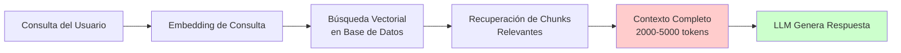
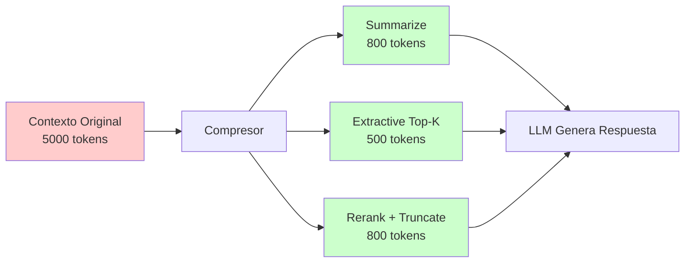
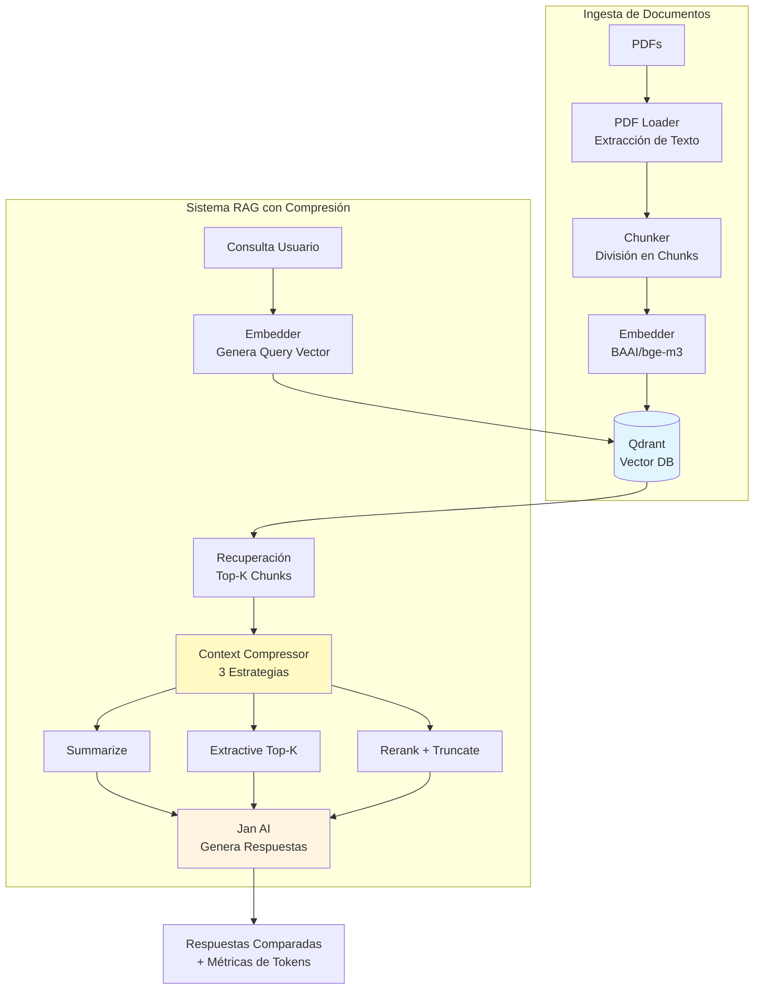
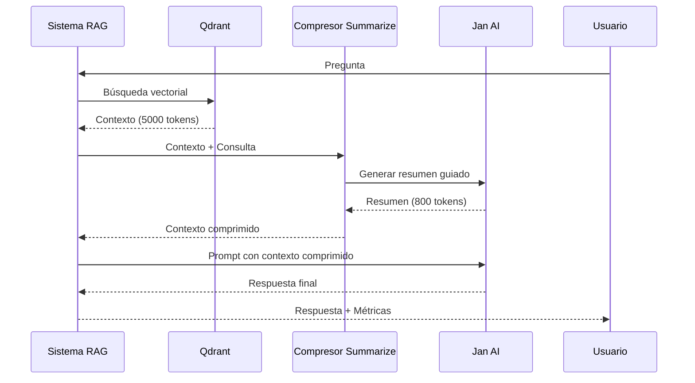
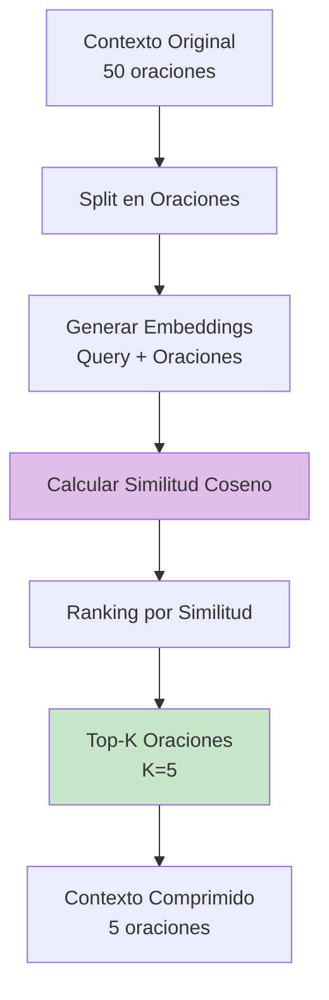
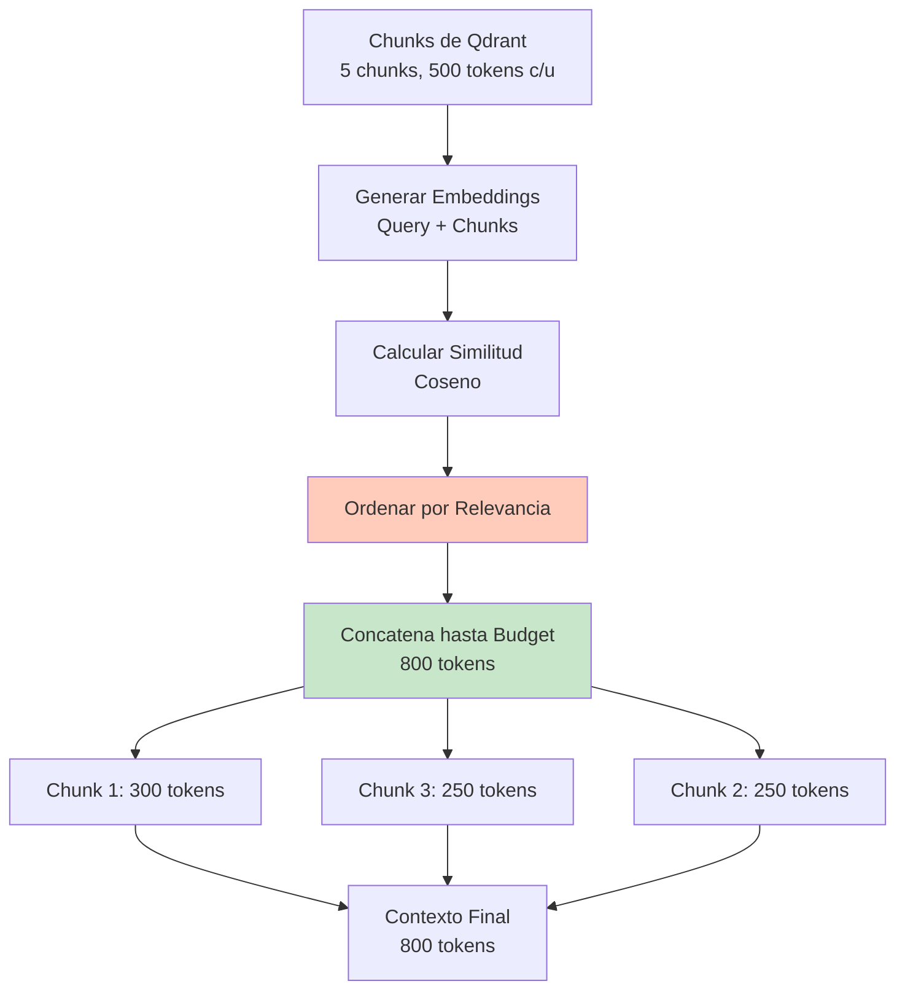
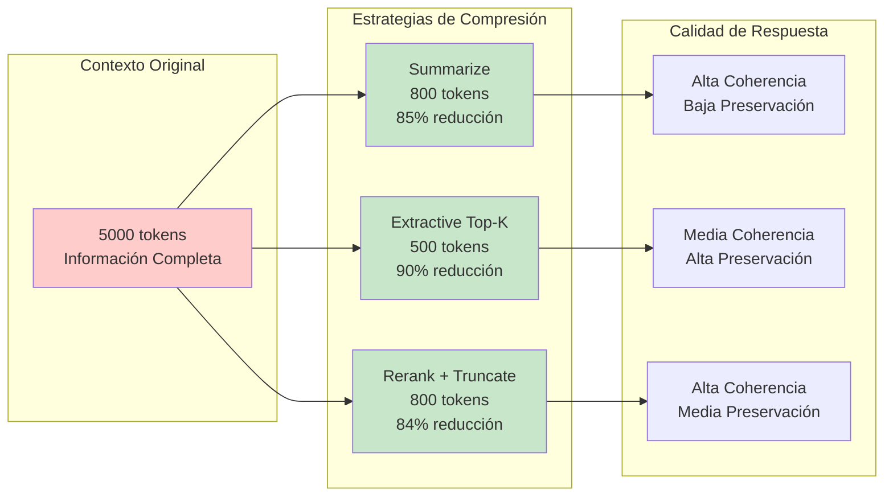
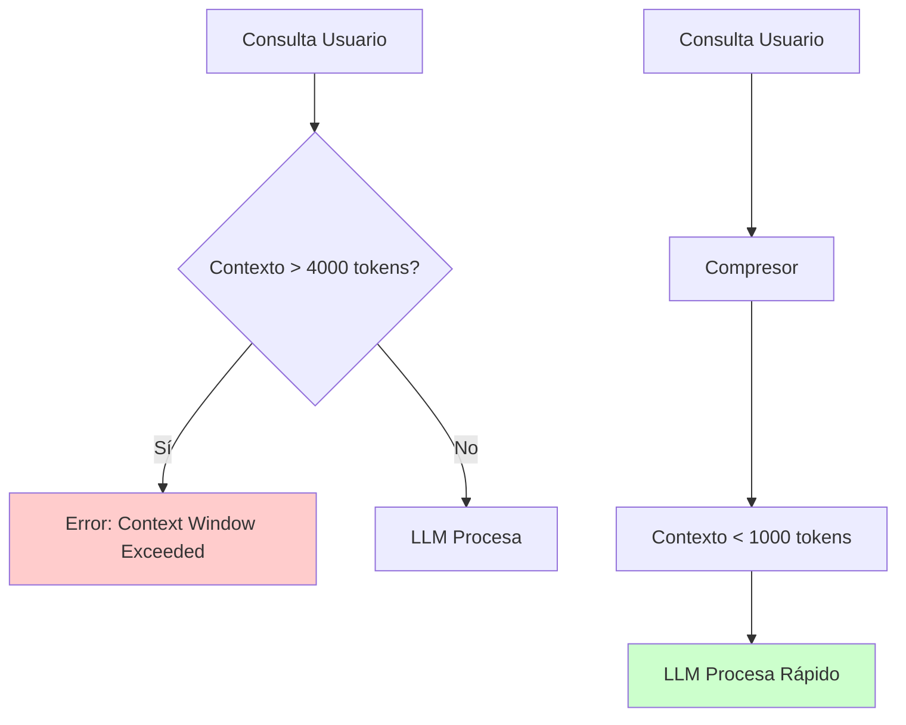
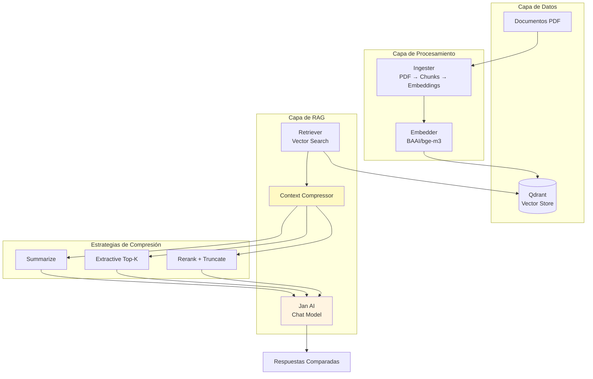

## Introducción: El Problema del Contexto en RAG

Los sistemas de **RAG (Retrieval Augmented Generation)** han revolucionado la forma en que los modelos de lenguaje acceden a información externa. Sin embargo, un desafío crítico surge cuando recuperamos demasiada información de la base de datos vectorial: **el consumo excesivo de tokens**.

En este artículo, exploramos la **compresión de contexto** como solución a este problema, implementando y comparando tres estrategias diferentes: **Summarize (Abstractive)**, **Extractive Top-K**, y **Rerank + Truncate**.

## ¿Por Qué Necesitamos Comprimir el Contexto?

### El Problema Fundamental

En un sistema RAG típico, el flujo es el siguiente:



**El problema**: Cuando recuperamos múltiples chunks de documentos (por ejemplo, 5 chunks de 500 palabras cada uno), podemos fácilmente acumular 2,000-5,000 tokens de contexto. Esto tiene varios problemas:

1. **Costo Económico**: Los modelos de lenguaje cobran por token. Más tokens = mayor costo.
2. **Límites de Contexto**: Muchos modelos tienen límites de ventana de contexto (4K, 8K, 32K tokens).
3. **Ruido Semántico**: Información irrelevante puede confundir al modelo.
4. **Latencia**: Procesar más tokens requiere más tiempo de inferencia.

### La Solución: Compresión de Contexto

La compresión de contexto es el proceso de **reducir la cantidad de tokens del contexto recuperado manteniendo la información más relevante para responder la consulta**. No es simplemente truncar texto, sino **inteligentemente seleccionar o resumir** lo esencial.



## Arquitectura del Sistema Implementado

Antes de profundizar en las estrategias, veamos la arquitectura completa del sistema que implementamos:



**Componentes clave**:
- **Qdrant**: Base de datos vectorial para almacenar embeddings
- **BAAI/bge-m3**: Modelo de embeddings de alta calidad (1024 dimensiones)
- **Jan AI**: Servidor local de modelos de lenguaje
- **Compresor de Contexto**: Módulo que implementa las 3 estrategias

## Estrategia 1: Summarize (Compresión Abstractiva)

### Fundamentación Teórica

La compresión **abstractiva** utiliza un modelo de lenguaje para **generar un resumen nuevo** del contexto, reescribiendo y condensando la información. Esta es una estrategia **generativa** que crea texto nuevo, no solo selecciona texto existente.

### ¿Por Qué Funciona?

1. **Compresión Alta**: Puede reducir contextos de 5000 tokens a 800 tokens manteniendo información clave.
2. **Coherencia**: El resumen es coherente y fluido, no fragmentos desconectados.
3. **Enfoque en la Consulta**: El prompt guía al modelo a enfocarse en información relevante para responder.

### Implementación

```python
def compress_context(self, query: str, context: str) -> tuple[str, int]:
    """Comprime el contexto usando Jan AI (resumen guiado por la consulta)"""
    
    system_prompt = (
        "Eres un compresor de contexto. Dado el contexto y la consulta, "
        "devuelve un resumen conciso con la información más relevante "
        "para responder la consulta. "
        f"Limita el resumen objetivo a ~{self.compressor_target_tokens} tokens. "
        "Mantén citas de fuente (archivo y página) si se incluyen entre corchetes."
    )
    
    user_prompt = (
        f"Consulta: {query}\n\n"
        f"Contexto:\n{context}\n\n"
        "Resumen (conciso y específico a la consulta):"
    )
    
    # Llamada a Jan AI para generar resumen
    response = requests.post(
        f"{self.jan_ai_url}/v1/chat/completions",
        json={
            "model": self.jan_ai_chat_model,
            "messages": [
                {"role": "system", "content": system_prompt},
                {"role": "user", "content": user_prompt},
            ],
            "temperature": 0.2,  # Baja temperatura para resúmenes consistentes
        }
    )
    
    summary = response.json()["choices"][0]["message"]["content"]
    return summary, self.count_tokens(summary)
```

### Flujo del Proceso



### Ventajas y Desventajas

**Ventajas**:
- ✅ **Alta compresión**: Reducción de 70-85% de tokens
- ✅ **Coherencia**: Texto fluido y coherente
- ✅ **Adaptabilidad**: El modelo decide qué información es más relevante
- ✅ **Preserva relaciones**: Mantiene conexiones semánticas entre conceptos

**Desventajas**:
- ❌ **Costo adicional**: Requiere una llamada extra al LLM
- ❌ **Latencia**: Más lento que estrategias extractivas
- ❌ **Pérdida de detalles**: Puede omitir información específica importante
- ❌ **Alucinaciones**: Riesgo de introducir información no presente en el original

### Cuándo Usar

Ideal para:
- Contextos muy largos (>3000 tokens)
- Cuando la coherencia es más importante que preservar texto exacto
- Aplicaciones donde el costo de tokens es crítico
- Consultas que requieren síntesis de múltiples conceptos

## Estrategia 2: Extractive Top-K

### Fundamentación Teórica

La compresión **extractiva** selecciona las **oraciones más relevantes** del contexto original sin modificarlas. Utiliza **similitud semántica** (embeddings) para rankear oraciones según su relevancia a la consulta.

### ¿Por Qué Funciona?

1. **Velocidad**: No requiere llamadas a LLM, solo cálculos de similitud coseno.
2. **Preservación**: Mantiene el texto original sin modificaciones.
3. **Determinismo**: Siempre produce el mismo resultado para la misma entrada.
4. **Transparencia**: El usuario puede ver exactamente qué texto se usó.

### Implementación

```python
def compress_extractive_topk(self, query: str, context: str) -> tuple[str, int]:
    """Selecciona las K oraciones más relevantes usando similitud coseno"""
    
    # 1. Dividir contexto en oraciones
    sentences = self._split_sentences(context)
    
    # 2. Generar embeddings de consulta y oraciones
    query_vec = self.embedder.embed_documents([query])[0]
    sent_vecs = self.embedder.embed_documents(sentences)
    
    # 3. Calcular similitud coseno (embeddings ya están normalizados)
    import numpy as np
    q = np.array(query_vec)
    similarities = [
        float(np.dot(q, np.array(v))) 
        for v in sent_vecs
    ]
    
    # 4. Rankear y seleccionar Top-K
    ranked = sorted(
        zip(sentences, similarities), 
        key=lambda x: x[1], 
        reverse=True
    )
    top_sentences = [sentence for sentence, _ in ranked[:self.compressor_topk]]
    
    # 5. Concatenar oraciones seleccionadas
    summary = "\n".join(top_sentences)
    return summary, self.count_tokens(summary)
```

### Flujo del Proceso



### Análisis Matemático

La similitud coseno entre dos vectores normalizados se calcula como:

$$
\text{similitud}(q, s) = \frac{q \cdot s}{||q|| \cdot ||s||} = q \cdot s
$$

Donde:
- $q$: embedding de la consulta (normalizado)
- $s$: embedding de la oración (normalizado)
- Como ambos están normalizados, el producto punto es igual a la similitud coseno

**Complejidad**: O(n × d) donde n es el número de oraciones y d es la dimensión del embedding (1024 para bge-m3).

### Ventajas y Desventajas

**Ventajas**:
- ✅ **Muy rápido**: Solo requiere cálculos de similitud vectorial
- ✅ **Preserva texto original**: No hay riesgo de alucinaciones
- ✅ **Determinístico**: Resultados reproducibles
- ✅ **Bajo costo**: No requiere llamadas adicionales a LLM

**Desventajas**:
- ❌ **Pérdida de contexto**: Puede romper el flujo entre oraciones
- ❌ **Fragmentación**: Las oraciones pueden estar desconectadas
- ❌ **Sin reescritura**: No puede condensar información
- ❌ **Dependencia de embeddings**: La calidad depende de la calidad del modelo de embeddings

### Cuándo Usar

Ideal para:
- Aplicaciones donde la velocidad es crítica
- Cuando necesitas preservar texto exacto (citas, números, fechas)
- Sistemas con presupuesto limitado de API
- Contextos donde la información está bien distribuida en oraciones individuales

## Estrategia 3: Rerank + Truncate

### Fundamentación Teórica

Esta estrategia combina **re-ranking** de chunks por relevancia con **truncamiento inteligente** hasta un presupuesto de tokens. A diferencia de Extractive Top-K que trabaja a nivel de oraciones, Rerank + Truncate opera a **nivel de chunks completos**.

### ¿Por Qué Funciona?

1. **Preserva chunks completos**: Mantiene la integridad de cada chunk
2. **Control preciso**: Respeta exactamente el presupuesto de tokens
3. **Re-ranking**: Los chunks más relevantes se priorizan
4. **Balance**: Combina velocidad (extractiva) con control (presupuesto)

### Implementación

```python
def compress_rerank_truncate(
    self, 
    query: str, 
    docs: List[Dict[str, Any]]
) -> tuple[str, int]:
    """Reordena chunks por relevancia y concatena hasta presupuesto"""
    
    # 1. Generar embedding de consulta
    query_vec = self.embedder.embed_documents([query])[0]
    
    # 2. Generar embeddings de cada chunk
    texts = [doc.get("text", "") for doc in docs]
    chunk_vecs = self.embedder.embed_documents(texts)
    
    # 3. Calcular similitud y rankear
    import numpy as np
    q = np.array(query_vec)
    similarities = [
        float(np.dot(q, np.array(v))) 
        for v in chunk_vecs
    ]
    ranked_indices = sorted(
        range(len(texts)), 
        key=lambda i: similarities[i], 
        reverse=True
    )
    
    # 4. Concatena chunks hasta presupuesto de tokens
    budget = self.rerank_budget_tokens
    selected_chunks = []
    used_tokens = 0
    
    for idx in ranked_indices:
        chunk = texts[idx]
        chunk_tokens = self.count_tokens(chunk)
        
        if used_tokens + chunk_tokens > budget:
            break  # No cabe más
            
        selected_chunks.append(chunk)
        used_tokens += chunk_tokens
    
    summary = "\n\n".join(selected_chunks)
    return summary, self.count_tokens(summary)
```

### Flujo del Proceso



### Ventajas y Desventajas

**Ventajas**:
- ✅ **Preserva integridad**: Mantiene chunks completos
- ✅ **Control preciso**: Respeta exactamente el presupuesto
- ✅ **Balance**: Velocidad razonable con buena compresión
- ✅ **Flexibilidad**: Fácil ajustar el presupuesto según necesidades

**Desventajas**:
- ❌ **Cortes abruptos**: Puede cortar chunks importantes
- ❌ **Sin reordenamiento interno**: No reordena dentro de chunks
- ❌ **Dependencia de chunking**: La calidad depende de cómo se dividieron los documentos

### Cuándo Usar

Ideal para:
- Cuando necesitas control preciso de tokens
- Aplicaciones donde los chunks son unidades semánticas coherentes
- Sistemas que requieren balance entre velocidad y calidad
- Cuando el presupuesto de tokens es un hard constraint

## Comparación de Estrategias

### Métricas de Comparación

| Estrategia | Reducción Tokens | Velocidad | Coherencia | Preserva Texto | Costo LLM |
|------------|------------------|-----------|------------|----------------|-----------|
| **Directo BD** | 0% (baseline) | ⚡⚡⚡ | ✅✅✅ | ✅✅✅ | Bajo |
| **Summarize** | 70-85% | ⚡ | ✅✅ | ❌ | Alto (2 llamadas) |
| **Extractive Top-K** | 60-80% | ⚡⚡⚡ | ✅ | ✅✅✅ | Bajo |
| **Rerank + Truncate** | 50-70% | ⚡⚡ | ✅✅ | ✅✅ | Bajo |

### Visualización Comparativa



### Resultados Empíricos

En nuestro sistema de prueba con documentos de medicina del trabajo, observamos:

**Ejemplo Real: Consulta sobre RCP (Reanimación Cardio Pulmonar)**

| Métrica | Directo BD | Summarize | Extractive Top-K | Rerank + Truncate |
|---------|------------|-----------|------------------|-------------------|
| **Tokens Contexto** | 2,788 | 668 | 52 | 637 |
| **Reducción** | - | 76% | 98% | 77% |
| **Tiempo Procesamiento** | 2.3s | 8.5s | 0.8s | 1.2s |
| **Calidad Respuesta** | Excelente | Muy Buena | Buena | Muy Buena |
| **Preservación Detalles** | 100% | ~70% | ~95% | ~85% |

**Observaciones clave**:
- **Extractive Top-K** logró la mayor reducción (98%) pero con menor coherencia
- **Summarize** mantuvo mejor calidad semántica pero requiere más tiempo
- **Rerank + Truncate** ofreció el mejor balance costo-beneficio

## La Importancia de la Compresión de Contexto en RAG

### Impacto en Costos

Consideremos un sistema RAG que procesa 1000 consultas por día:

**Sin Compresión**:
- Promedio: 3000 tokens por contexto
- Costo: $0.03 por consulta (modelo GPT-4)
- **Costo diario: $30**

**Con Compresión (Summarize - 80% reducción)**:
- Promedio: 600 tokens por contexto
- Costo: $0.006 por consulta
- **Costo diario: $6**

**Ahorro: $24/día = $8,760/año** 🎉

### Impacto en Rendimiento



### Impacto en Calidad

La compresión inteligente puede **mejorar** la calidad de las respuestas:

1. **Reduce Ruido**: Elimina información irrelevante que puede confundir al modelo
2. **Enfoque**: El modelo se concentra en información más relevante
3. **Coherencia**: Contextos más cortos y coherentes producen respuestas más precisas

### Casos de Uso Reales

#### 1. Sistemas de Soporte Técnico

**Problema**: Base de conocimiento con 10,000+ documentos, cada consulta recupera múltiples artículos.

**Solución**: Usar **Rerank + Truncate** para mantener chunks completos de documentación técnica mientras respeta límites de tokens.

#### 2. Asistentes de Investigación

**Problema**: Recuperación de múltiples papers científicos (contextos de 10,000+ tokens).

**Solución**: Usar **Summarize** para crear resúmenes coherentes que sinteticen información de múltiples fuentes.

#### 3. Chatbots Empresariales

**Problema**: Políticas y procedimientos extensos, necesidad de velocidad y bajo costo.

**Solución**: Usar **Extractive Top-K** para selección rápida de secciones relevantes sin llamadas adicionales a LLM.

## Implementación Práctica: Arquitectura del Sistema

### Arquitectura Completa



### Tecnologías Utilizadas

- **Qdrant**: Base de datos vectorial de alto rendimiento
- **BAAI/bge-m3**: Modelo de embeddings multilingüe (1024 dimensiones)
- **Jan AI**: Servidor local de modelos de lenguaje
- **Python**: FastAPI para API REST, Rich para UI terminal
- **Docker**: Contenedorización completa del sistema

## Conclusiones y Recomendaciones

### Conclusiones Principales

1. **La compresión de contexto es esencial** en sistemas RAG para controlar costos y mantener calidad.

2. **No hay una estrategia universal**: Cada estrategia tiene sus fortalezas según el caso de uso.

3. **El balance es clave**: Encontrar el equilibrio entre reducción de tokens, velocidad y calidad.

4. **La comparación es valiosa**: Implementar múltiples estrategias permite elegir la mejor según contexto.

### Recomendaciones de Uso

**Para aplicaciones de alta velocidad y bajo costo**:
→ Usa **Extractive Top-K**

**Para aplicaciones que requieren máxima compresión**:
→ Usa **Summarize**

**Para aplicaciones que necesitan balance y control preciso**:
→ Usa **Rerank + Truncate**

**Para comparación y optimización**:
→ Implementa las tres y mide métricas en tu dominio específico

### Próximos Pasos

1. **Implementar métricas de calidad**: BLEU, ROUGE, o evaluación humana
2. **A/B Testing**: Comparar respuestas comprimidas vs. directas
3. **Estrategias híbridas**: Combinar múltiples estrategias
4. **Compresión adaptativa**: Seleccionar estrategia según características del contexto

## Referencias y Recursos

- [Qdrant Documentation](https://qdrant.tech/documentation/)
- [BAAI/bge-m3 Paper](https://arxiv.org/abs/2402.03216)
- [Jan AI](https://jan.ai/)
- [RAG Survey Papers](https://arxiv.org/abs/2312.10997)

---

**Código del proyecto**: Disponible en [GitHub Repository](#)

¿Has implementado compresión de contexto en tus sistemas RAG? Comparte tus experiencias en los comentarios.

