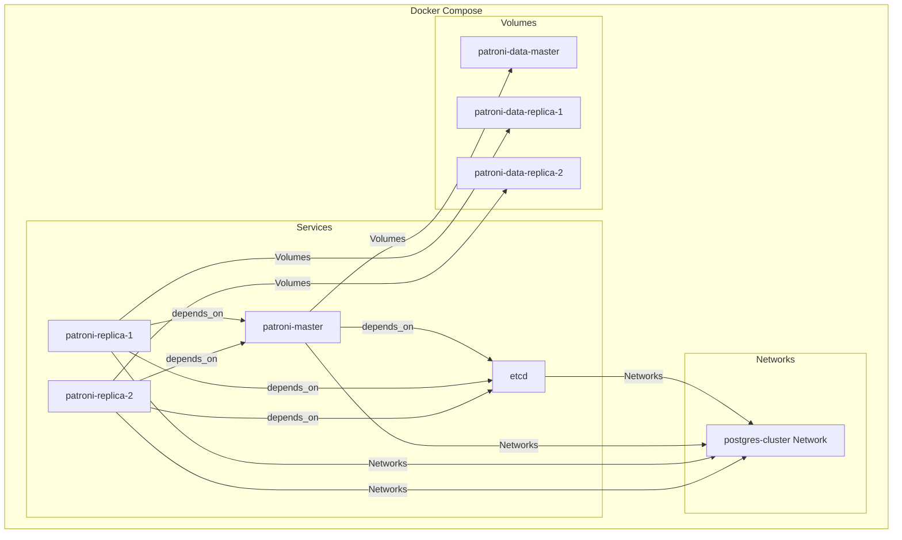
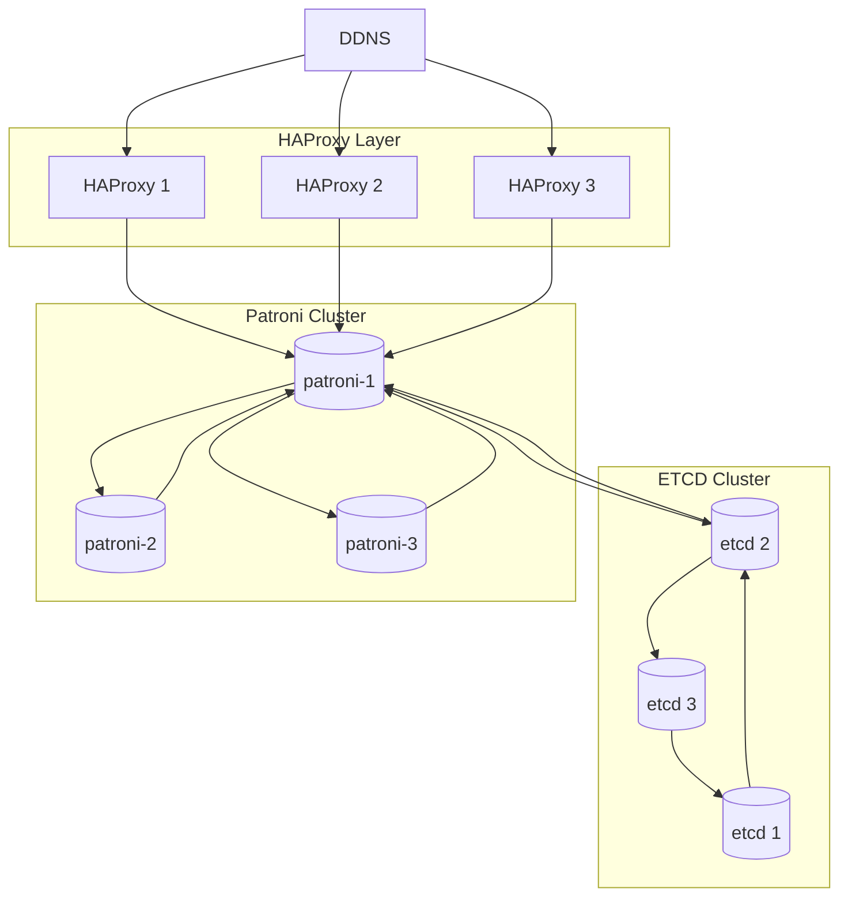

# Cluster de Base de Datos Postgres con Patroni

## Descripción

Este proyecto comenzo como una prueba de concepto (PoC) que demuestra la implementación de una base de datos PostgreSQL con alta disponibilidad utilizando Patroni, etcd y Haproxy. El objetivo era simular un entorno PostgreSQL que luego se implemento en produccion, asegurando una alta disponibilidad.

## Tecnologías Utilizadas (PoC)

**PostgreSQL:** Sistema de gestión de bases de datos relacional.

**Docker:** Contenedores para empaquetar y ejecutar la aplicación.

**Docker Compose:** Herramienta para definir y ejecutar aplicaciones multi-contenedor.

**Patroni:** Herramienta para gestionar la replicación y alta disponibilidad de PostgreSQL.

**etcd:** Almacén de clave-valor distribuido utilizado para la coordinación en Patroni.

## Diagrama del Cluster Postgres


## Instalación

### Crear imagen custom de Postgres

```dockerfile
FROM postgres:17.4

# Instalar dependencias
RUN apt-get update && apt-get install -y \
    python3 \
    python3-pip \
    && rm -rf /var/lib/apt/lists/*

# Instalar Patroni
RUN mv /usr/lib/python3.11/EXTERNALLY-MANAGED /usr/lib/python3.11/EXTERNALLY-MANAGED.old && pip3 install psycopg2-binary patroni[etcd]

# Copiar el archivo de configuración de Patroni
COPY patroni.yml /etc/patroni.yml
RUN chown postgres:postgres /etc/patroni.yml

# Copiar el script de inicio
COPY entrypoint.sh /entrypoint.sh
RUN chmod +x /entrypoint.sh

USER postgres

# Establecer el script de inicio como comando de inicio
CMD ["/entrypoint.sh"]
```

### Crear entrypoint

```bash
#!/bin/bash

if [ -d "/var/lib/postgresql/data" ]; then
    chmod 750 /var/lib/postgresql/data
    chown -R postgres:postgres /var/lib/postgresql/data
fi

# Iniciar Patroni
exec patroni /etc/patroni.yml
```

### Archivo de configuración Patroni

```yaml
scope: postgres-cluster
name: patroni-master

restapi:
  listen: 0.0.0.0:8008
  connect_address: patroni-master:8008

etcd:
  hosts: etcd:2379
  protocol: http
  api_version: v3

bootstrap:
  dcs:
    ttl: 30
    loop_wait: 10
    retry_timeout: 10
    maximum_lag_on_failover: 1048576
    postgresql:
      use_pg_rewind: true
      use_slots: true
      parameters:
        wal_level: replica
        hot_standby: "on"
        wal_keep_size: 128MB
        max_wal_senders: 10
        max_replication_slots: 10
        checkpoint_timeout: 15

  initdb:
    - encoding: UTF8
    - locale: en_US.UTF-8

  pg_hba:
    - host replication replicator 0.0.0.0/0 md5
    - host all all 0.0.0.0/0 md5

postgresql:
  listen: 0.0.0.0:5432
  connect_address: haproxy:5000
  data_dir: /var/lib/postgresql/data
  bin_dir: /usr/lib/postgresql/17/bin
  pgpass: /tmp/pgpass
  authentication:
    replication:
      username: replicator
      password: replicatorpass
    superuser:
      username: admin
      password: secret

```

### Levantar el cluster con docker compose

```YAML
networks:
  postgres-cluster:

services:
  etcd:
    image: quay.io/coreos/etcd:v3.4.14
    container_name: etcd
    environment:
      ETCD_LISTEN_PEER_URLS: http://0.0.0.0:2380
      ETCD_LISTEN_CLIENT_URLS: http://0.0.0.0:2379
      ETCD_ADVERTISE_CLIENT_URLS: http://etcd:2379
      ETCD_INITIAL_CLUSTER: etcd=http://etcd:2380
      ETCD_INITIAL_CLUSTER_STATE: new
      ETCD_INITIAL_CLUSTER_TOKEN: poc
      ETCD_ENABLE_V2: "true"

    networks:
      - postgres-cluster
    command: etcd --name etcd --initial-advertise-peer-urls http://etcd:2380

  patroni-master:
    build: .
    container_name: patroni-master
    environment:
      PATRONI_NAME: patroni-master
      PATRONI_ETCD3_HOSTS: "'etcd:2379'"
    volumes:
      - patroni-data-master:/var/lib/postgresql/data
    ports:
      - "5432:5432"
      - "8008:8008"
    networks:
      - postgres-cluster
    depends_on:
      - etcd

  patroni-replica-1:
    build: .
    container_name: patroni-replica-1
    environment:
      PATRONI_NAME: patroni-replica-1
      PATRONI_ETCD3_HOSTS: "'etcd:2379'"
    volumes:
      - patroni-data-replica-1:/var/lib/postgresql/data
    ports:
      - "5433:5432"
      - "8009:8008"
    networks:
      - postgres-cluster
    depends_on:
      - etcd
      - patroni-master

  patroni-replica-2:
    build: .
    container_name: patroni-replica-2
    environment:
      PATRONI_NAME: patroni-replica-2
      PATRONI_ETCD3_HOSTS: "'etcd:2379'"
    volumes:
      - patroni-data-replica-2:/var/lib/postgresql/data
    ports:
      - "5434:5432"
      - "8010:8008"
    networks:
      - postgres-cluster
    depends_on:
      - etcd
      - patroni-master

  haproxy:
    image: haproxy:2.4
    container_name: haproxy
    volumes:
      - ./haproxy.cfg:/usr/local/etc/haproxy/haproxy.cfg:ro
    ports:
      - "5000:5000"
    networks:
      - postgres-cluster
    depends_on:
      - patroni-master
      - patroni-replica-1
      - patroni-replica-2

volumes:
  patroni-data-master:
  patroni-data-replica-1:
  patroni-data-replica-2:
```

### Uso
**conectate al nodo master

```bash
docker exec -it patroni-master psql -U admin -d postgres
```

**Crea una tabla e inserta datos

```sql
CREATE TABLE test_table (id SERIAL PRIMARY KEY, name TEXT);
INSERT INTO test_table (name) VALUES ('Test 1'), ('Test 2');
```

**Verifica en las réplicas

```sql
docker exec -it patroni-replica-1 psql -U admin -d postgres -c "SELECT * FROM test_table;"
```

```sql
docker exec -it patroni-replica-2 psql -U admin -d postgres -c "SELECT * FROM test_table;"
```

# Cluster en Producción



## Cambios para que se implementarion en produccion
Para implementar este modelo de base de datos se tuvieron que realizar diversos ajustes para proporcionar redundancia y alta disponibilidad:
### Implementaciones
**X3 Haproxy:** Adicion dos servicios de Haproxy mas, conectados al ddns para poder garantizar el acceso cluster con hasta dos servicios en falla. Ademas el Ddns balancea la carga entre los tres utilizando Round Robin. (Los servicios de Haproxy son individuales, no hay cluster)
**Cluster Etcd:** Aplicación de un Cluster Etcd, para respaldar la integridad del cluster Postgres. Ya que una falla en el servicio del almacén ocasiona un desarme del cluster
