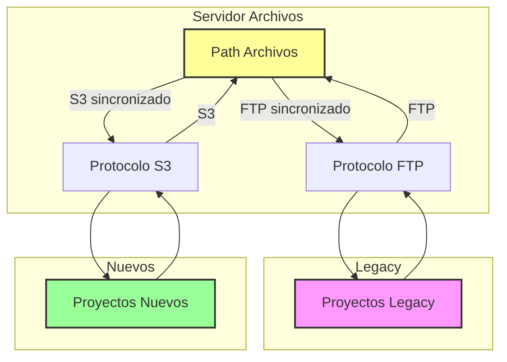

# Cluster de Base de Datos Postgres con Patroni

## Descripción

En muchos entornos heredados, FTP sigue siendo el pilar para el almacenamiento y la transferencia de archivos. A pesar de su antigüedad, todavía está presente en organizaciones que dependen de grandes volúmenes de datos acumulados durante años.

Por otro lado, el mundo moderno de la infraestructura ya habla un idioma distinto: S3 y los servicios compatibles se han convertido en el estándar de facto para la integración con aplicaciones, sistemas distribuidos y entornos cloud.

El desafío surge cuando estas dos realidades conviven. Migrar enormes cantidades de archivos desde servidores FTP hacia un bucket S3 no solo es costoso en tiempo, sino también difícil de mantener en sincronía. En muchos casos, esa migración total resulta impráctica o directamente inviable, dejando a los equipos atrapados entre lo viejo y lo nuevo.

---

Este proyecto tiene como objetivo modernizar los protocolos de transferencia de archivos sin necesidad de migrar toda la infraestructura a la nube, garantizando al mismo tiempo la compatibilidad con sistemas heredados que aún dependen de FTP.

La solución consiste en mantener operativo el protocolo FTP mientras se habilita el acceso mediante S3, permitiendo que los proyectos nuevos utilicen directamente S3 y que, de manera progresiva, los proyectos existentes en FTP puedan migrarse hacia este estándar moderno. Una vez completada la transición, el servicio FTP podrá ser descontinuado, dejando a S3 como único punto de acceso.

Además, los archivos estarán siempre sincronizados: el path en S3 es exactamente el mismo que utiliza actualmente el sistema vía FTP, lo que asegura continuidad y transparencia en el uso de datos.

---





## Rclone

## ¿Qué es Rclone?

[Rclone](https://rclone.org/) es una herramienta de línea de comandos **open-source** diseñada para gestionar y sincronizar archivos en diferentes sistemas de almacenamiento.  
Funciona como un *puente universal* entre el almacenamiento tradicional y la nube, permitiendo trabajar de manera unificada con múltiples servicios.  

### Características principales
- 🔄 **Sincronización y copia** entre almacenamiento local, FTP, SFTP, WebDAV y más de 70 proveedores cloud (incluyendo Amazon S3, Google Drive, Azure, Backblaze, etc.).  
- 🛡️ **Verificación de integridad** mediante hashes (MD5, SHA1, etc.), asegurando que los archivos se transfieran sin errores.  
- ▶️ **Reanudación de transferencias** interrumpidas, ideal para mover grandes volúmenes de datos.  
- 📂 **Montaje de remotos** como discos locales en Linux, Windows y macOS.  
- 🌐 **Servir archivos directamente** a través de protocolos como HTTP, WebDAV, FTP o incluso como un endpoint **compatible con S3**, lo que permite exponer datos sin necesidad de migrarlos.  
- ⚡ **Automatización** a través de scripts, facilitando flujos de trabajo de backup y sincronización.  

En pocas palabras, **rclone convierte la nube en una extensión del sistema de archivos local**, y además puede actuar como un **servidor de archivos flexible**, integrando entornos heredados con aplicaciones modernas sin grandes esfuerzos de migración.


## ¿Qué es el protocolo S3?

El **protocolo S3** (Simple Storage Service) fue creado por Amazon Web Services como la base de su servicio de almacenamiento en la nube **Amazon S3**.  
Con el tiempo, se convirtió en un **estándar de facto** para acceder a almacenamiento de objetos, y hoy en día es soportado por una gran variedad de proveedores y plataformas open-source.  

### Características principales
- 📦 **Almacenamiento de objetos**: los datos se organizan en *buckets* (contenedores) que almacenan objetos compuestos por el archivo en sí y metadatos.  
- 🌐 **Acceso mediante API HTTP/HTTPS**: todas las operaciones (subida, descarga, listado, borrado, permisos, etc.) se realizan a través de peticiones REST o SDKs compatibles.  
- 🔑 **Gestión de permisos y autenticación** mediante credenciales de acceso (Access Key / Secret Key) y políticas detalladas.  
- 📈 **Escalabilidad y durabilidad**: diseñado para manejar desde unos pocos archivos hasta petabytes de información.  
- 🤝 **Compatibilidad amplia**: muchos servicios y herramientas (incluido [Rclone](https://rclone.org/)) soportan el protocolo S3, lo que facilita integraciones sin depender exclusivamente de AWS.  

En resumen, **S3 no es solo un servicio de Amazon, sino un lenguaje universal para interactuar con almacenamiento de objetos**, adoptado tanto en la nube pública como en soluciones on-premise.


## Setup Linux (Tambien es posible realizarlo en Windows)
En este caso se utilizo el mismo servidor FTP para exponer el servicio (Como se muestra en el grafico)

Instalacion Rclone:

```bash
sudo -v ; curl https://rclone.org/install.sh | sudo bash
```

Crear servicio para exponer el path del ftp como S3:


```bash
nano /etc/systemd/system/rclone-s3.service
```


```bash
[Unit]
Description=Rclone serve S3 for remote FTP-S3
Documentation=https://rclone.org/commands/rclone_serve_s3/
After=network-online.target
Wants=network-online.target

[Service]
Type=simple
User=root
ExecStart=/usr/bin/rclone serve s3 /path/to/ftp \
  --addr :9001 \
  --auth-key usuario,apikey123
Restart=on-failure
RestartSec=5s

[Install]
WantedBy=multi-user.target
```


```bash
sudo systemctl daemon-reload
```


```bash
sudo systemctl start rclone-s3.service
```


```bash
sudo systemctl enable rclone-s3.service
```

Con esto ya estaria corriendo el servicio. Lo proximo que se deberia hacer es realizar una configuracion en el firewall y si es posible exponerlo a traves de un reverse proxy

---

## **Plus** Rclone UI

Es posible habilitar una web UI de Rclone para facilitar algunas tareas, esto es completamente opcional


```bash
nano /etc/systemd/system/rclone-ui.service
```


```bash
[Unit]
Description=Rclone Remote Control (rcd) with Web GUI
Documentation=https://rclone.org/commands/rclone_rcd/
After=network.target

[Service]
Type=simple
User=root
ExecStart=/usr/bin/rclone rcd \
    --rc-web-gui \
    --rc-user usuario \
    --rc-pass password \
    --rc-addr :5572
Restart=on-failure
RestartSec=10
LimitNOFILE=65535

[Install]
WantedBy=multi-user.target
```


```bash
sudo systemctl daemon-reload
```


```bash
sudo systemctl start rclone-ui.service
```


```bash
sudo systemctl enable rclone-ui.service
```

Con esto podremos habilitar la ui y acceder a traves de http://hostdelftp:5572 Lo recomendable es modificar las reglas del firewall y exponerlo a traves de un reverse proxy

---
## Pruebas de conexion

Instalar [aws-cli](https://docs.aws.amazon.com/cli/latest/userguide/getting-started-install.html)

Ejecuta el comando:

```bash
aws configure --profile rclone-local
```


Luego ingresa los datos:

```bash
AWS Access Key ID: usuario

AWS Secret Access Key: apikey123

Default region: us-east-1 (puede ser cualquiera)

Default output: json
```

Listar archivos del bucket:

```bash
aws s3 ls s3://mi-bucket --endpoint-url http://localhost:9001 --profile rclone-local
```

Si los archivos se listan correctamente al igual que en FTP, el protocolo ha sido configurado correctamente
---
