## 📚 ¿Qué es Blue/Green Deployment?

Blue/Green es una estrategia de deployment que mantiene dos entornos idénticos en producción:

- **Blue**: Versión activa recibiendo todo el tráfico
- **Green**: Versión de standby preparada para activarse

Al hacer un nuevo deployment:
1. Se despliega la nueva versión en el entorno inactivo
2. Se espera a que esté completamente operativa
3. Se cambia el tráfico instantáneamente
4. La versión anterior se escala a 0 réplicas

## ✨ Ventajas Clave

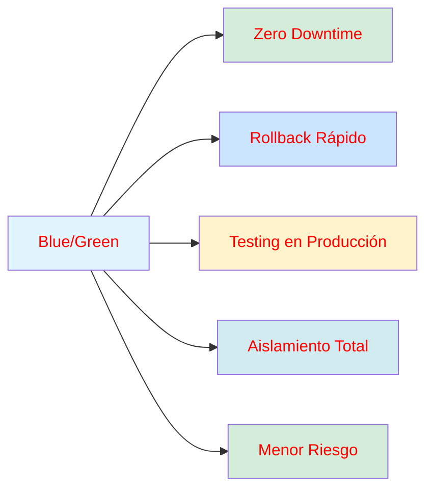

- ✅ **Zero Downtime**: El tráfico nunca se interrumpe
- ✅ **Rollback Instantáneo**: Solo cambiar el selector del servicio
- ✅ **Testing en Producción**: Validar antes de cambiar tráfico
- ✅ **Sin Impacto**: Usuarios activos nunca se ven afectados
- ✅ **Menor Riesgo**: Fallos no afectan producción inmediata

---

## ⚡ Inicio Rápido

Guía para tener Blue/Green deployments funcionando en menos de 10 minutos.

### Prerrequisitos

- [ ] Cluster de Kubernetes configurado
- [ ] kubectl instalado y configurado
- [ ] Acceso al cluster
- [ ] GitHub Actions configurado
- [ ] Secrets configurados en GitHub

### Paso 1: Configurar Registry Secret

```bash
kubectl create secret docker-registry registry-secret \
  --docker-server=ghcr.io \
  --docker-username="YOUR_USERNAME" \
  --docker-password="YOUR_PAT" \
  --docker-email="your-email@example.com"
```

### Paso 2: Aplicar Deployments

```bash
# Aplicar deployment blue
kubectl apply -f deployment-blue.yaml

# Aplicar deployment green
kubectl apply -f deployment-green.yaml

# Aplicar servicio (apuntando a blue por defecto)
kubectl apply -f service.yaml
```

### Paso 3: Verificar Estado

```bash
# Ver deployments
kubectl get deployments -l app=myapp

# Ver pods
kubectl get pods -l app=myapp

# Ver servicio
kubectl get svc myapp-svc

# Ver versión activa
kubectl get svc myapp-svc -o jsonpath='{.spec.selector.version}'
```

Deberías ver algo como:

```
NAME                  READY   UP-TO-DATE   AVAILABLE   AGE
myapp-blue            1/1     1            1           5m
myapp-green           0/1     1            0           5m

NAME                        STATUS    AGE
myapp-svc                   ClusterIP 5m

Versión activa: blue
```

### Paso 4: Hacer un Deployment

#### Deployment Automático (GitHub Actions)

```bash
# Hacer push a main
git push origin main

# El workflow automáticamente:
# 1. Build de imagen
# 2. Push a GHCR
# 3. Blue/Green deployment
```

#### Deployment Manual

Si necesitas hacer un deployment manual:

```bash
# Detectar versión actual
CURRENT=$(kubectl get svc myapp-svc -o jsonpath='{.spec.selector.version}')

# Calcular próxima versión
[ "$CURRENT" = "blue" ] && NEXT="green" || NEXT="blue"

# Desplegar
kubectl set image deployment/myapp-$NEXT myapp=ghcr.io/YOUR_ORG/YOUR_APP:latest

# Esperar rollout
kubectl rollout status deployment/myapp-$NEXT --timeout=5m

# Cambiar tráfico
kubectl patch svc myapp-svc -p "{\"spec\":{\"selector\":{\"version\":\"$NEXT\"}}}"

# Limpiar versión anterior
kubectl scale deployment/myapp-$CURRENT --replicas=0
```

---

## 🏗️ Arquitectura del Sistema

### Vista General

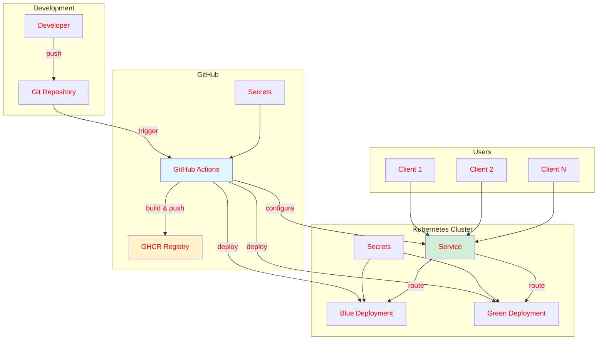

### Componentes Principales

#### 1. GitHub Actions Workflow

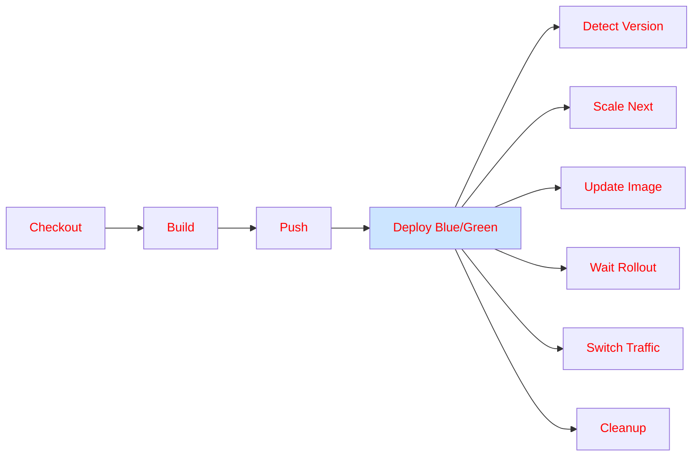

#### 2. Kubernetes Resources

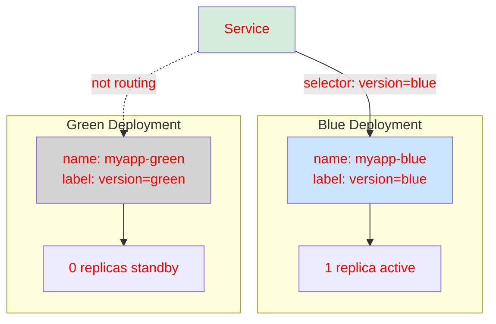

### Flujo de Datos

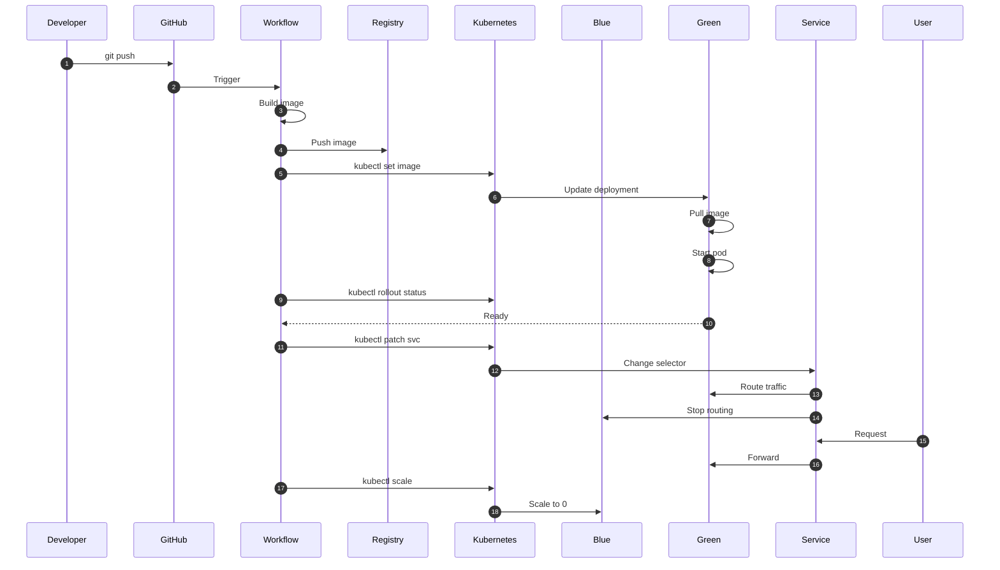

---

## 🔄 Flujo Completo de Deployment

### Ciclo de Deployment

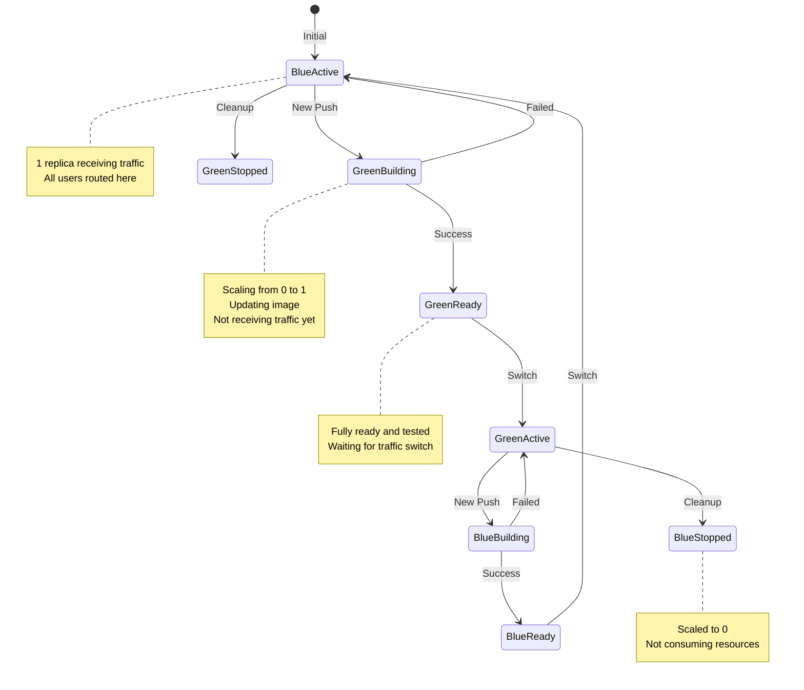

### Timeline del Deployment

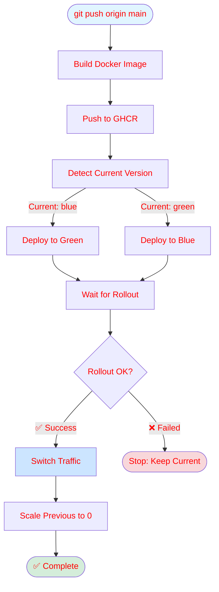

---

## 📊 Diagrama Detallado del Workflow

### Pipeline Completo

```mermaid
%%{init: {"themeVariables": { "textColor": "#ff0000"}}}%%
graph TD
    Start([Push a main / Manual Trigger]) --> Checkout[Checkout Code]
    Checkout --> ShowContext[Show Context]
    ShowContext --> LoginGHCR[Login to GHCR]
    LoginGHCR --> CreateEnv[Create .env from Secrets]
    CreateEnv --> BuildImage[Build Docker Image]
    
    BuildImage --> BuildDetails{2 Tags}
    BuildDetails -->|ghcr.io/YOUR_ORG/YOUR_APP:SHA| Tag1[Tag: $SHA]
    BuildDetails -->|ghcr.io/YOUR_ORG/YOUR_APP:latest| Tag2[Tag: latest]
    
    Tag1 --> PushImage
    Tag2 --> PushImage[Push to GHCR]
    
    PushImage --> CleanEnv[Clean up .env]
    CleanEnv --> SetupKubeconfig[Set up Kubeconfig]
    
    SetupKubeconfig --> DetectVersion[Detect Current Version]
    DetectVersion --> VersionLogic{Get Service Selector}
    
    VersionLogic -->|version=blue| NextGreen[Next: Green]
    VersionLogic -->|version=green| NextBlue[Next: Blue]
    
    NextGreen --> ScaleNext
    NextBlue --> ScaleNext[Scale Next to 1 Replica]
    
    ScaleNext --> CheckReplicas{Replicas = 0?}
    CheckReplicas -->|Yes| ScaleUp[Scale to 1]
    CheckReplicas -->|No| SkipScale[Skip: Already running]
    
    ScaleUp --> UpdateImage
    SkipScale --> UpdateImage[Update Image to $SHA]
    
    UpdateImage --> WaitRollout[Wait for Rollout]
    WaitRollout --> RolloutCheck{Rollout OK?}
    
    RolloutCheck -->|Success| SwitchTraffic[Switch Traffic]
    RolloutCheck -->|Failed| Error[❌ Deployment Failed]
    Error --> StopPipeline([Stop Pipeline<br/>Keep Current Version])
    
    SwitchTraffic --> PatchService[Patch Service Selector]
    PatchService --> ScalePrevious[Scale Previous to 0]
    
    ScalePrevious --> GenerateSummary[Generate Summary]
    GenerateSummary --> Success([✅ Deployment Complete<br/>Zero Downtime])
    
    style Start fill:#e1f5ff
    style Success fill:#d4edda
    style Error fill:#f8d7da
    style StopPipeline fill:#f8d7da
    style BuildImage fill:#fff3cd
    style PushImage fill:#fff3cd
    style SwitchTraffic fill:#cce5ff
    style DetectVersion fill:#d1ecf1
    style RolloutCheck fill:#ffeaa7
```

### Timeline

```mermaid
gantt
    title Typical Deployment Timeline
    dateFormat X
    axisFormat %s
    
    section Build Phase
    Checkout & Setup     :0, 10
    Build Image         :10, 60
    Push to GHCR        :60, 90
    
    section Deploy Phase
    Setup Kubeconfig    :90, 100
    Detect Version      :100, 105
    Scale Deployment    :105, 115
    Update Image        :115, 120
    Wait for Rollout    :120, 180
    
    section Switch Phase
    Switch Traffic      :180, 185
    Scale Previous      :185, 195
```

**Objetivos:**
- Total time: < 5 minutos
- Downtime: 0 segundos
- Switch latency: < 1 segundo

---

## 🎯 Puntos Clave de Diseño

### 1. Aislamiento Total

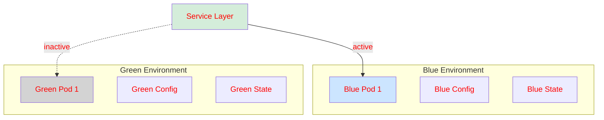

**Beneficios:**
- Cero interferencia entre versiones
- Testing completo antes del switch
- Rollback sin riesgo

### 2. Tráfico Direccionado

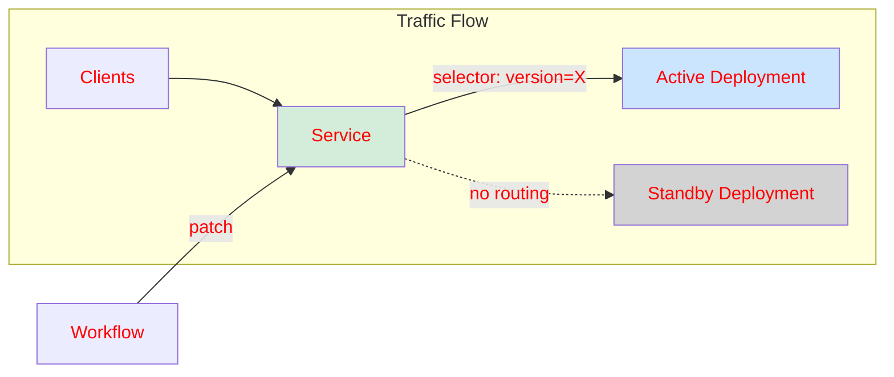

**Características:**
- Cambio instantáneo del selector
- Sin pérdida de conexiones
- Downtime = 0 segundos

### 3. Gestión de Recursos

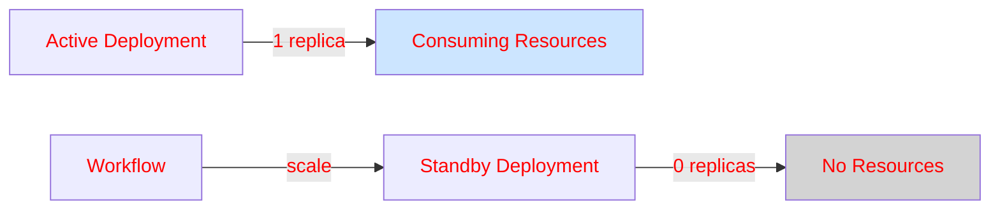

**Optimización:**
- Solo versión activa consume recursos
- Standby escalado a 0 automáticamente
- Rollback rápido: escalar a 1

---

## 🔐 Seguridad

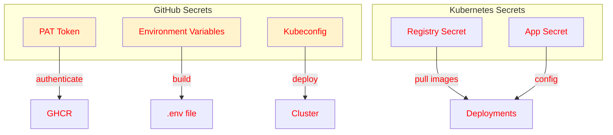

### Secretos Requeridos

**GitHub Secrets:**
- `PAT` - Personal Access Token
- `USERNAME` - GitHub username
- `KUBECONFIG_CONTENT` - Configuración del cluster
- Variables de entorno de la aplicación

**Kubernetes Secrets:**
- `registry-secret` - Credenciales del registry
- `myapp-secret` - Variables de entorno

---

## 🔙 Rollback Rápido

Si necesitas hacer rollback inmediato:

```bash
# Obtener versión activa
CURRENT=$(kubectl get svc myapp-svc -o jsonpath='{.spec.selector.version}')

# Determinar versión anterior
[ "$CURRENT" = "blue" ] && PREV="green" || PREV="blue"

# Cambiar tráfico de vuelta
kubectl patch svc myapp-svc \
  -p "{\"spec\":{\"selector\":{\"version\":\"$PREV\"}}}"

# Escalar versión actual a 0
kubectl scale deployment myapp-$CURRENT --replicas=0

echo "✅ Rollback completado a versión: $PREV"
```

**Tiempo de rollback:** 5-10 segundos ⚡

---

## 🚨 Puntos de Falla y Mitigación

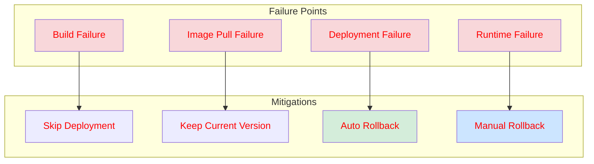

---

## 🐛 Troubleshooting

### El pod no inicia

```bash
# Ver logs
kubectl logs -l app=myapp --tail=50

# Ver eventos
kubectl get events --field-selector involvedObject.kind=Pod

# Ver descripción del pod
kubectl describe pod -l app=myapp,version=blue
```

### El servicio no enruta

```bash
# Verificar endpoints
kubectl get endpoints myapp-svc

# Verificar selector
kubectl get svc myapp-svc -o yaml | grep selector
```

### Imagen no se descarga

```bash
# Verificar secret
kubectl describe secret registry-secret

# Ver eventos
kubectl describe pod -l app=myapp,version=blue
```

---

## 📈 Escalabilidad

### Horizontal Scaling

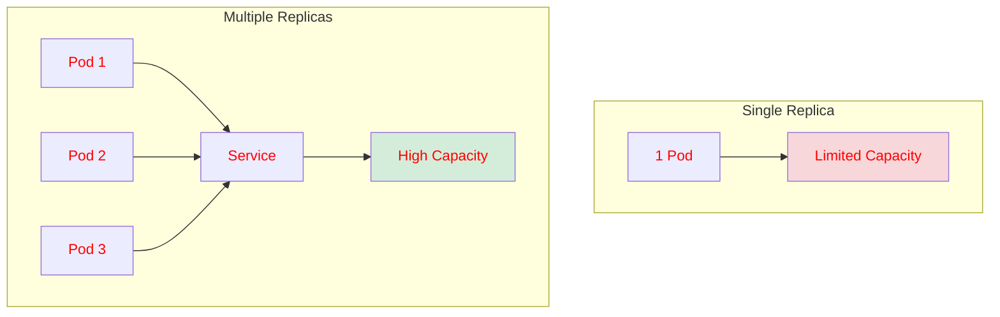

**Para escalar:**

```yaml
spec:
  replicas: 3  # Cambiar en deployment-blue.yaml y deployment-green.yaml
```

### Load Balancing

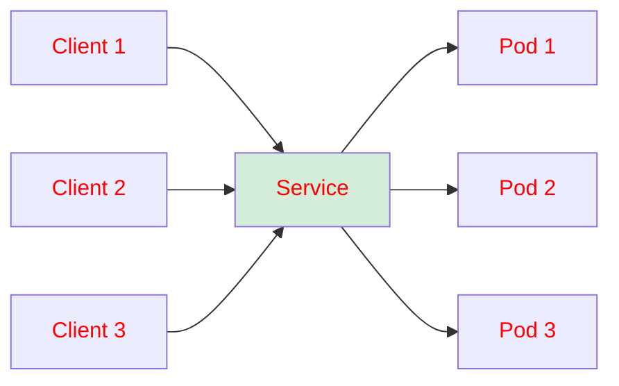

El servicio Kubernetes balancea automáticamente entre réplicas.

---

## 📊 Archivos del Proyecto

### Estructura

```
blue-green-deployments/
├── deployment-blue.yaml      # Deployment para entorno Blue
├── deployment-green.yaml     # Deployment para entorno Green
├── service.yaml              # Service con selector dinámico
├── Docker-build-and-push.yaml  # GitHub Actions workflow
├── scripts/
│   └── install-blue-green.sh   # Script de instalación inicial
└── README.md                    # Documentación general
```

### Deployments (ejemplo)
#### Blue

```yaml
apiVersion: apps/v1
kind: Deployment
metadata:
  name: myapp-blue
  labels:
    app: myapp
    version: blue
spec:
  replicas: 1
  selector:
    matchLabels:
      app: myapp
      version: blue
  template:
    metadata:
      labels:
        app: myapp
        version: blue
    spec:
      containers:
        - name: myapp
          image: ghcr.io/YOUR_ORG/YOUR_APP:latest
          imagePullPolicy: Always
          ports:
            - containerPort: 3001
          envFrom:
            - secretRef:
                name: myapp-secret
      imagePullSecrets:
        - name: registry-secret
```

#### Green

```yaml
apiVersion: apps/v1
kind: Deployment
metadata:
  name: crm-bot-api-green
  labels:
    app: crm-bot-api
    version: green
spec:
  replicas: 1
  selector:
    matchLabels:
      app: crm-bot-api
      version: green
  template:
    metadata:
      labels:
        app: crm-bot-api
        version: green
    spec:
      containers:
        - name: crm-bot-api
          image: ghcr.io/org-sistemas-sn/crm-bot-api:latest
          imagePullPolicy: Always
          ports:
            - containerPort: 3001
          envFrom:
            - secretRef:
                name: crm-bot-api-secret
      imagePullSecrets:
        - name: ghcr-secret
```

### Service

```yaml
apiVersion: v1
kind: Service
metadata:
  name: myapp-svc
  labels:
    app: myapp
spec:
  type: NodePort
  selector:
    app: myapp
    version: blue  # Cambia dinámicamente
  ports:
    - name: http
      port: 3001
      targetPort: 3001
      nodePort: 30059
```

### 🔑 Explicación de Labels y Selectores

El Blue/Green deployment funciona gracias a **labels** (etiquetas) y **selectors** (selectores) en Kubernetes.

#### ¿Qué son los Labels?

Los labels son pares clave-valor que puedes adjuntar a cualquier objeto de Kubernetes. Son fundamentales para organizar y seleccionar recursos.

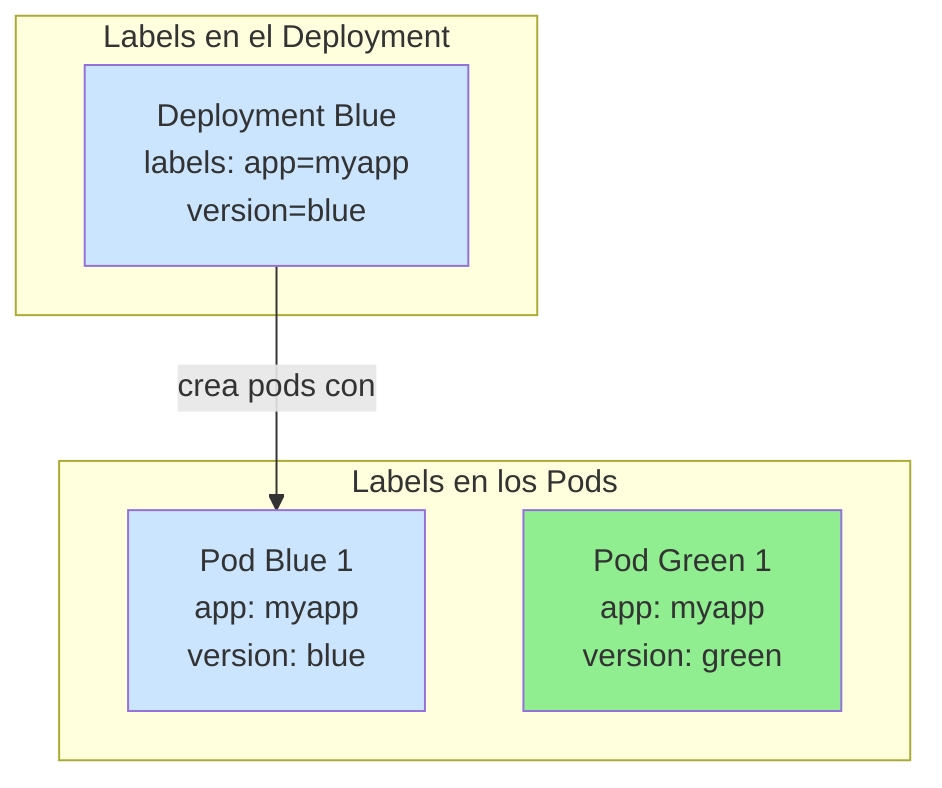

#### Tres Niveles de Labels

**1. Labels del Deployment (metadata.labels)**
- Etiquetan el Deployment
- Útiles para filtrado: `kubectl get deployments -l app=myapp`
- No afectan el comportamiento del deployment

**2. Labels del Selector (spec.selector.matchLabels)**
```yaml
selector:
  matchLabels:
    app: myapp
    version: blue
```
- Definen qué pods gestiona este deployment
- Deben coincidir con los labels de los pods
- Blue gestiona pods con `version=blue`
- Green gestiona pods con `version=green`

**3. Labels del Pod Template (spec.template.metadata.labels)**
```yaml
template:
  metadata:
    labels:
      app: myapp
      version: blue
```
- Labels aplicados a los pods creados
- Deben coincidir con el selector
- Kubernetes valida esta coherencia

#### El Selector del Service

El **selector del Service** decide a qué pods enruta el tráfico:

```yaml
spec:
  selector:
    app: myapp       # Etiqueta común a todos
    version: blue    # Etiqueta que cambia
```

**Cómo funciona el enrutamiento:**

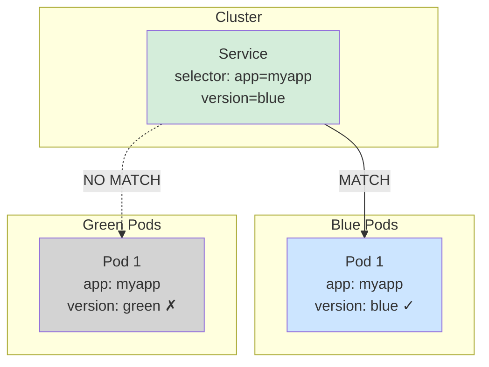

#### Flujo de enrutamiento

**Estado inicial (Blue activo):**

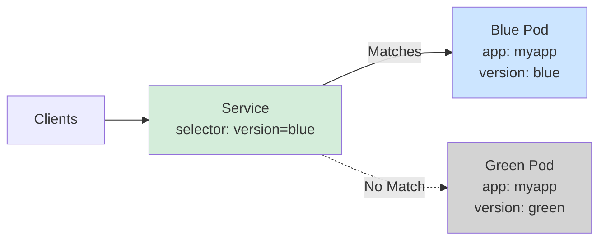

**Después del switch (Green activo):**

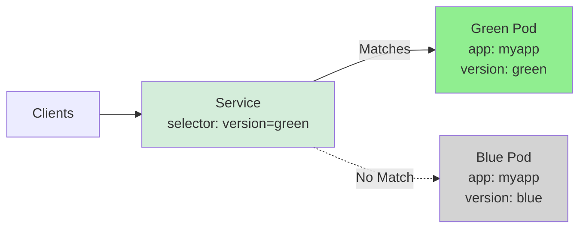

#### Cómo cambiar el tráfico

El workflow usa `kubectl patch` para cambiar el selector:

```bash
kubectl patch service myapp-svc \
  -p '{"spec":{"selector":{"app":"myapp","version":"green"}}}'
```

**Proceso:**

```mermaid
sequenceDiagram
    participant Workflow
    participant Service
    participant BluePod
    participant GreenPod
    
    Note over Service: Initial State<br/>selector: version=blue
    
    Client->>Service: Request
    Service->>BluePod: Forward (match)
    
    Note over Workflow: New deployment ready
    
    Workflow->>Service: kubectl patch selector: green
    Service->>Service: Update selector
    
    Note over Service: New State<br/>selector: version=green
    
    Client->>Service: New Request
    Service->>GreenPod: Forward (match)
    Service->>BluePod: Stop routing (no match)
    
    Note over Workflow,Service: ✅ Zero Downtime!
```

#### Ejemplo práctico

Verificar los labels:

```bash
# Ver labels del deployment
kubectl get deployment myapp-blue --show-labels
# Output: app=myapp,version=blue

# Ver labels de los pods
kubectl get pods -l app=myapp --show-labels

# Output:
# NAME                        READY   STATUS    LABELS
# myapp-blue-xxx              1/1     Running   app=myapp,version=blue
# myapp-green-xxx             1/1     Running   app=myapp,version=green

# Ver selector del service
kubectl get svc myapp-svc -o yaml | grep -A 3 selector
# Output:
#   selector:
#     app: myapp
#     version: blue

# Verificar qué pods están siendo enrutados
kubectl get endpoints myapp-svc
# Output:
# NAME                ENDPOINTS
# myapp-svc           10.244.1.5:3001  (Blue pod IP)
```

#### Resumen

```mermaid
graph TB
    subgraph "1. Deployment Labels"
        A[Deployment: version=blue]
        B[Pods creados: version=blue]
    end
    
    subgraph "2. Service Selector"
        C[Service selector:<br/>app + version]
    end
    
    subgraph "3. Matching"
        D{Pods con labels<br/>que coinciden?}
        E[✓ Recibe tráfico]
        F[✗ No recibe tráfico]
    end
    
    A --> B
    B --> D
    C --> D
    D -->|Match| E
    D -->|No Match| F
    
    style A fill:#cce5ff
    style C fill:#d4edda
    style E fill:#90EE90
    style F fill:#d3d3d3
```

**Conclusión:**
- Blue y Green comparten `app=myapp`
- `version` los diferencia
- El selector del Service cambia dinámicamente
- Solo los pods coincidentes reciben tráfico
- Instantáneo y sin pérdida de conexiones

---

## ✅ Checklist de Post-Deployment

Después de tu primer deployment:

- [ ] Verificar que el servicio responde
- [ ] Confirmar que no hubo downtime
- [ ] Probar rollback
- [ ] Configurar monitoreo
- [ ] Documentar para tu equipo

---

## 🎓 Patrones Aplicados

### 1. Canary Deployment (Potencial Evolución)

```mermaid
graph TB
    A[100% Blue] --> B[90% Blue 10% Green]
    B --> C[50% Blue 50% Green]
    C --> D[10% Blue 90% Green]
    D --> E[100% Green]
    
    style A fill:#cce5ff
    style E fill:#d4edda
```

**Nota:** Actualmente se usa switch instantáneo, pero puedes evolucionar a canary.

### 2. Feature Flags (Extensión Futura)

```mermaid
graph TB
    A[Deployment] --> B{Feature Flag}
    B -->|Enabled| C[New Feature]
    B -->|Disabled| D[Old Behavior]
    
    E[Config] --> B
    
    style B fill:#fff3cd
```

### 3. Database Migration Strategies

```mermaid
graph TB
    A[Schema v1] --> B[Schema v2 Compatible]
    B --> C[Schema v2]
    
    D[Blue: v1] --> E[Green: v2]
    
    style A fill:#f8d7da
    style B fill:#fff3cd
    style C fill:#d4edda
```

---

## 🔄 Evolución del Sistema

```mermaid
graph LR
    A[v1.0: Basic BG] --> B[v2.0: GitHub Actions]
    B --> C[v3.0: Canary?]
    C --> D[v4.0: Multi-Region?]
    
    style A fill:#f8d7da
    style B fill:#fff3cd
    style C fill:#cce5ff
    style D fill:#d4edda
```

---

## 📊 Resumen

### Características Principales

- ✅ **Zero Downtime Deployments**
- ✅ **Rollback Rápido** (solo cambiar selector)
- ✅ **Testing en Producción** antes del switch
- ✅ **Escalado Inteligente** (solo activa consume recursos)
- ✅ **Manejo de Errores** (cancela si falla)
- ✅ **Logging Detallado** en cada paso
- ✅ **GitHub Actions Integration**

### Métricas Objetivo

- **Deployment Time**: < 5 minutos
- **Downtime**: 0 segundos
- **Rollback Time**: < 10 segundos
- **Failure Detection**: Automático
- **Resource Efficiency**: Solo activa consume recursos

---

## 📝 Notas Importantes

⚠️ **Migraciones de DB**: Ejecutar antes del deployment  
⚠️ **Sessions**: Usar storage externo (Redis)  
⚠️ **Secrets**: Nunca hardcodear en el código  
⚠️ **Testing**: Siempre probar en staging primero

---

**Creado con ❤️ para deployments sin downtime** 🚀

