## 📚 ¿Qué es Blue/Green Deployment?

Blue/Green es una estrategia de deployment que mantiene dos entornos idénticos en producción:

- **Blue**: Versión activa recibiendo todo el tráfico
- **Green**: Versión de standby preparada para activarse

Al hacer un nuevo deployment:
1. Se despliega la nueva versión en el entorno inactivo
2. Se espera a que esté completamente operativa
3. Se cambia el tráfico instantáneamente
4. La versión anterior se escala a 0 réplicas

## ✨ Ventajas Clave

```mermaid
%%{init: {"themeVariables": { "textColor": "#ff0000"}}}%%
graph LR
    A[Blue/Green] --> B[Zero Downtime]
    A --> C[Rollback Rápido]
    A --> D[Testing en Producción]
    A --> E[Aislamiento Total]
    A --> F[Menor Riesgo]
    
    style A fill:#e1f5ff
    style B fill:#d4edda
    style C fill:#cce5ff
    style D fill:#fff3cd
    style E fill:#d1ecf1
    style F fill:#d4edda
```



- ✅ **Zero Downtime**: El tráfico nunca se interrumpe
- ✅ **Rollback Instantáneo**: Solo cambiar el selector del servicio
- ✅ **Testing en Producción**: Validar antes de cambiar tráfico
- ✅ **Sin Impacto**: Usuarios activos nunca se ven afectados
- ✅ **Menor Riesgo**: Fallos no afectan producción inmediata

---

## ⚡ Inicio Rápido

Guía para tener Blue/Green deployments funcionando en menos de 10 minutos.

### Prerrequisitos

- [ ] Cluster de Kubernetes configurado
- [ ] kubectl instalado y configurado
- [ ] Acceso al cluster
- [ ] GitHub Actions configurado
- [ ] Secrets configurados en GitHub

### Paso 1: Configurar Registry Secret

```bash
kubectl create secret docker-registry registry-secret \
  --docker-server=ghcr.io \
  --docker-username="YOUR_USERNAME" \
  --docker-password="YOUR_PAT" \
  --docker-email="your-email@example.com"
```

### Paso 2: Aplicar Deployments

```bash
# Aplicar deployment blue
kubectl apply -f deployment-blue.yaml

# Aplicar deployment green
kubectl apply -f deployment-green.yaml

# Aplicar servicio (apuntando a blue por defecto)
kubectl apply -f service.yaml
```

### Paso 3: Verificar Estado

```bash
# Ver deployments
kubectl get deployments -l app=myapp

# Ver pods
kubectl get pods -l app=myapp

# Ver servicio
kubectl get svc myapp-svc

# Ver versión activa
kubectl get svc myapp-svc -o jsonpath='{.spec.selector.version}'
```

Deberías ver algo como:

```
NAME                  READY   UP-TO-DATE   AVAILABLE   AGE
myapp-blue            1/1     1            1           5m
myapp-green           0/1     1            0           5m

NAME                        STATUS    AGE
myapp-svc                   ClusterIP 5m

Versión activa: blue
```

### Paso 4: Hacer un Deployment

#### Deployment Automático (GitHub Actions)

```bash
# Hacer push a main
git push origin main

# El workflow automáticamente:
# 1. Build de imagen
# 2. Push a GHCR
# 3. Blue/Green deployment
```

#### Deployment Manual

Si necesitas hacer un deployment manual:

```bash
# Detectar versión actual
CURRENT=$(kubectl get svc myapp-svc -o jsonpath='{.spec.selector.version}')

# Calcular próxima versión
[ "$CURRENT" = "blue" ] && NEXT="green" || NEXT="blue"

# Desplegar
kubectl set image deployment/myapp-$NEXT myapp=ghcr.io/YOUR_ORG/YOUR_APP:latest

# Esperar rollout
kubectl rollout status deployment/myapp-$NEXT --timeout=5m

# Cambiar tráfico
kubectl patch svc myapp-svc -p "{\"spec\":{\"selector\":{\"version\":\"$NEXT\"}}}"

# Limpiar versión anterior
kubectl scale deployment/myapp-$CURRENT --replicas=0
```

---

## 🏗️ Arquitectura del Sistema

### Vista General


### Componentes Principales

#### 1. GitHub Actions Workflow


#### 2. Kubernetes Resources


### Flujo de Datos


---

## 🔄 Flujo Completo de Deployment

### Ciclo de Deployment


### Timeline del Deployment

```mermaid
%%{init: {"themeVariables": { "textColor": "#ff0000"}}}%%
graph TB
    Start([git push origin main]) --> Build[Build Docker Image]
    Build --> Push[Push to GHCR]
    Push --> Detect[Detect Current Version]
    
    Detect -->|Current: blue| DeployGreen[Deploy to Green]
    Detect -->|Current: green| DeployBlue[Deploy to Blue]
    
    DeployGreen --> Wait[Wait for Rollout]
    DeployBlue --> Wait
    
    Wait --> Check{Rollout OK?}
    
    Check -->|✅ Success| Switch[Switch Traffic]
    Check -->|❌ Failed| Stop([Stop: Keep Current])
    
    Switch --> Cleanup[Scale Previous to 0]
    Cleanup --> Success([✅ Complete])
    
    style Start fill:#e1f5ff
    style Switch fill:#cce5ff
    style Success fill:#d4edda
    style Stop fill:#f8d7da
```



---

## 📊 Diagrama Detallado del Workflow

### Pipeline Completo

```mermaid
%%{init: {"themeVariables": { "textColor": "#ff0000"}}}%%
graph TD
    Start([Push a main / Manual Trigger]) --> Checkout[Checkout Code]
    Checkout --> ShowContext[Show Context]
    ShowContext --> LoginGHCR[Login to GHCR]
    LoginGHCR --> CreateEnv[Create .env from Secrets]
    CreateEnv --> BuildImage[Build Docker Image]
    
    BuildImage --> BuildDetails{2 Tags}
    BuildDetails -->|ghcr.io/YOUR_ORG/YOUR_APP:SHA| Tag1[Tag: $SHA]
    BuildDetails -->|ghcr.io/YOUR_ORG/YOUR_APP:latest| Tag2[Tag: latest]
    
    Tag1 --> PushImage
    Tag2 --> PushImage[Push to GHCR]
    
    PushImage --> CleanEnv[Clean up .env]
    CleanEnv --> SetupKubeconfig[Set up Kubeconfig]
    
    SetupKubeconfig --> DetectVersion[Detect Current Version]
    DetectVersion --> VersionLogic{Get Service Selector}
    
    VersionLogic -->|version=blue| NextGreen[Next: Green]
    VersionLogic -->|version=green| NextBlue[Next: Blue]
    
    NextGreen --> ScaleNext
    NextBlue --> ScaleNext[Scale Next to 1 Replica]
    
    ScaleNext --> CheckReplicas{Replicas = 0?}
    CheckReplicas -->|Yes| ScaleUp[Scale to 1]
    CheckReplicas -->|No| SkipScale[Skip: Already running]
    
    ScaleUp --> UpdateImage
    SkipScale --> UpdateImage[Update Image to $SHA]
    
    UpdateImage --> WaitRollout[Wait for Rollout]
    WaitRollout --> RolloutCheck{Rollout OK?}
    
    RolloutCheck -->|Success| SwitchTraffic[Switch Traffic]
    RolloutCheck -->|Failed| Error[❌ Deployment Failed]
    Error --> StopPipeline([Stop Pipeline<br/>Keep Current Version])
    
    SwitchTraffic --> PatchService[Patch Service Selector]
    PatchService --> ScalePrevious[Scale Previous to 0]
    
    ScalePrevious --> GenerateSummary[Generate Summary]
    GenerateSummary --> Success([✅ Deployment Complete<br/>Zero Downtime])
    
    style Start fill:#e1f5ff
    style Success fill:#d4edda
    style Error fill:#f8d7da
    style StopPipeline fill:#f8d7da
    style BuildImage fill:#fff3cd
    style PushImage fill:#fff3cd
    style SwitchTraffic fill:#cce5ff
    style DetectVersion fill:#d1ecf1
    style RolloutCheck fill:#ffeaa7
```



### Timeline


**Objetivos:**
- Total time: < 5 minutos
- Downtime: 0 segundos
- Switch latency: < 1 segundo

---

## 🔧 Workflow de GitHub Actions

### Estructura Completa

```yaml
name: Docker build and push

on:
  push:
    branches: [ main ]
  workflow_dispatch:

jobs:
  build-and-push:
    runs-on: ubuntu-latest
    permissions:
      packages: write
      contents: read
      actions: write

    steps:
      # 1. Preparación
      - name: Checkout code
        uses: actions/checkout@v3
        
      - name: Login to GHCR
        run: echo "${{ secrets.PAT }}" | docker login ghcr.io -u "${{ secrets.USERNAME }}" --password-stdin

      # 2. Build y Push
      - name: Build Docker image
        run: |
          docker buildx build \
            -t ghcr.io/YOUR_ORG/YOUR_APP:${{ github.sha }} \
            -t ghcr.io/YOUR_ORG/YOUR_APP:latest \
            $GITHUB_WORKSPACE

      - name: Push image to GHCR
        run: |
          docker push ghcr.io/YOUR_ORG/YOUR_APP:${{ github.sha }}
          docker push ghcr.io/YOUR_ORG/YOUR_APP:latest

      # 3. Kubernetes Setup
      - name: Set up Kubeconfig
        run: |
          echo "${{ secrets.KUBECONFIG_CONTENT }}" > $GITHUB_WORKSPACE/kubeconfig

      # 4. Blue/Green Deployment
      - name: Detect Current Version
        id: detect-version
        run: |
          CURRENT=$(kubectl get service myapp-svc -o jsonpath='{.spec.selector.version}')
          if [ "$CURRENT" = "blue" ]; then
            NEXT="green"
          else
            NEXT="blue"
          fi
          echo "current=$CURRENT" >> $GITHUB_OUTPUT
          echo "next=$NEXT" >> $GITHUB_OUTPUT

      - name: Scale Next Version to 1 Replica
        run: |
          REPLICAS=$(kubectl get deployment myapp-${{ steps.detect-version.outputs.next }} -o jsonpath='{.spec.replicas}' 2>/dev/null || echo "0")
          if [ "$REPLICAS" = "0" ]; then
            kubectl scale deployment/myapp-${{ steps.detect-version.outputs.next }} --replicas=1
          fi

      - name: Update Image to Next Version
        run: |
          kubectl set image deployment/myapp-${{ steps.detect-version.outputs.next }} \
            myapp=ghcr.io/YOUR_ORG/YOUR_APP:${{ github.sha }}

      - name: Wait for Rollout to Complete
        run: |
          kubectl rollout status deployment/myapp-${{ steps.detect-version.outputs.next }} --timeout=5m

      - name: Switch Traffic to Next Version
        run: |
          kubectl patch service myapp-svc \
            -p "{\"spec\":{\"selector\":{\"app\":\"myapp\",\"version\":\"${{ steps.detect-version.outputs.next }}\"}}}"

      - name: Scale Previous Version to 0
        run: |
          kubectl scale deployment/myapp-${{ steps.detect-version.outputs.current }} --replicas=0

      - name: Generate deployment summary
        run: |
          echo "## Deployment Summary (Blue/Green)" >> $GITHUB_STEP_SUMMARY
          echo "- **Image:** \`ghcr.io/YOUR_ORG/YOUR_APP:${{ github.sha }}\`" >> $GITHUB_STEP_SUMMARY
          echo "- **Versión Anterior:** \`${{ steps.detect-version.outputs.current }}\` → **Nueva:** \`${{ steps.detect-version.outputs.next }}\`" >> $GITHUB_STEP_SUMMARY
```

### Pasos del Workflow

```mermaid
%%{init: {"themeVariables": { "textColor": "#ff0000"}}}%%
graph TD
    subgraph "Fase 1: Preparación"
        A1[Checkout Code]
        A2[Login GHCR]
    end
    
    subgraph "Fase 2: Build"
        B1[Build Image]
        B2[Push Images]
    end
    
    subgraph "Fase 3: Deploy"
        C1[Setup Kubeconfig]
        C2[Detect Version]
        C3[Scale Next]
        C4[Update Image]
        C5[Wait Rollout]
        C6[Switch Traffic]
        C7[Scale Previous]
        C8[Generate Summary]
    end
    
    A1 --> A2
    A2 --> B1
    B1 --> B2
    B2 --> C1
    C1 --> C2
    C2 --> C3
    C3 --> C4
    C4 --> C5
    C5 --> C6
    C6 --> C7
    C7 --> C8
    
    style A1 fill:#e1f5ff
    style B1 fill:#fff3cd
    style C6 fill:#cce5ff
    style C8 fill:#d4edda
```



### Detalles de Cada Fase

#### Fase 1: Preparación (30-60 segundos)

```yaml
- Checkout code: Descarga el código del repositorio
- Login GHCR: Autenticación con GitHub Container Registry
```

#### Fase 2: Build (60-120 segundos)

```yaml
- Build Image: Construye imagen con dos tags
  - $SHA: Identificador único del commit
  - latest: Tag para facilitar referencias
  
- Push Images: Sube ambas imágenes al registry
```

#### Fase 3: Deploy (120-180 segundos)

**3.1 Setup Kubernetes**
```yaml
- Set up Kubeconfig: Configura acceso al cluster
```

**3.2 Detección Inteligente**
```yaml
- Detect Current Version: Lee el selector del servicio
  Output: current=blue, next=green (o viceversa)
```

**3.3 Preparación del Deploy**
```yaml
- Scale Next: Escala el deployment inactivo a 1 si está en 0
- Update Image: Actualiza la imagen al SHA del commit
- Wait Rollout: Espera confirmación de que está listo
```

**3.4 Switch de Tráfico**
```yaml
- Switch Traffic: Cambia el selector del servicio (instantáneo)
- Scale Previous: Escala versión anterior a 0
```

**3.5 Finalización**
```yaml
- Generate Summary: Crea resumen en GitHub Actions UI
```

### Variables del Workflow

#### Outputs del Step "detect-version"

Estos outputs se usan en los siguientes steps:

```yaml
steps.detect-version.outputs.current  # "blue" o "green"
steps.detect-version.outputs.next     # "green" o "blue"
```

#### GitHub Context Variables

```yaml
github.sha         # SHA del commit actual
github.ref_name    # Nombre de la rama (main)
```

#### Secrets Requeridos

```yaml
secrets.PAT              # Personal Access Token
secrets.USERNAME         # Usuario de GitHub
secrets.KUBECONFIG_CONTENT  # Config del cluster
```

### Ejemplo de Ejecución

```yaml
Trigger: git push origin main
         ↓
Checkout: Código descargado
         ↓
Login: Autenticado en GHCR
         ↓
Build: Image ghcr.io/org/app:abc123def built
       Image ghcr.io/org/app:latest built
         ↓
Push: Ambas imágenes subidas
         ↓
Detect: current=blue, next=green
         ↓
Scale: Green → 1 replica
         ↓
Update: Image actualizada a abc123def
         ↓
Wait: Green deployment ready ✅
         ↓
Switch: Service selector → version=green ⚡
         ↓
Scale: Blue → 0 replicas
         ↓
Summary: Deployment completed
```

### Manejo de Errores

```mermaid
%%{init: {"themeVariables": { "textColor": "#ff0000"}}}%%
flowchart TD
    Start[Workflow Start] --> Build{Build Success?}
    
    Build -->|❌ No| Fail1[❌ Workflow Fails<br/>No deployment]
    Build -->|✅ Yes| Push{Push Success?}
    
    Push -->|❌ No| Fail2[❌ Workflow Fails<br/>Image not pushed]
    Push -->|✅ Yes| Rollout{Rollout Success?}
    
    Rollout -->|❌ No| Clean[Scale deployment to 0<br/>Keep current active]
    Rollout -->|✅ Yes| Switch[Switch Traffic]
    
    Clean --> Success[✅ Workflow completes<br/>No downtime]
    Switch --> Success2[✅ Workflow completes<br/>New version active]
    
    style Fail1 fill:#f8d7da
    style Fail2 fill:#f8d7da
    style Clean fill:#fff3cd
    style Success fill:#d4edda
    style Success2 fill:#d4edda
```



### Ventajas de esta Implementación

✅ **Todo en un workflow**: Build, test, deploy en un solo pipeline  
✅ **Automatización completa**: Sin intervención manual  
✅ **Rollback automático**: Si falla, se detiene antes del switch  
✅ **Visibilidad total**: Cada paso es visible en GitHub Actions  
✅ **Outputs reutilizables**: Variables pasan entre steps  
✅ **Verificación en cada paso**: Errores detectados tempranamente  

---

## 🎯 Puntos Clave de Diseño

### 1. Aislamiento Total


**Beneficios:**
- Cero interferencia entre versiones
- Testing completo antes del switch
- Rollback sin riesgo

### 2. Tráfico Direccionado


**Características:**
- Cambio instantáneo del selector
- Sin pérdida de conexiones
- Downtime = 0 segundos

### 3. Gestión de Recursos


**Optimización:**
- Solo versión activa consume recursos
- Standby escalado a 0 automáticamente
- Rollback rápido: escalar a 1

---

## 🔐 Seguridad


### Secretos Requeridos

**GitHub Secrets:**
- `PAT` - Personal Access Token
- `USERNAME` - GitHub username
- `KUBECONFIG_CONTENT` - Configuración del cluster
- Variables de entorno de la aplicación

**Kubernetes Secrets:**
- `registry-secret` - Credenciales del registry
- `myapp-secret` - Variables de entorno

---

## 🔙 Rollback Rápido

Si necesitas hacer rollback inmediato:

```bash
# Obtener versión activa
CURRENT=$(kubectl get svc myapp-svc -o jsonpath='{.spec.selector.version}')

# Determinar versión anterior
[ "$CURRENT" = "blue" ] && PREV="green" || PREV="blue"

# Cambiar tráfico de vuelta
kubectl patch svc myapp-svc \
  -p "{\"spec\":{\"selector\":{\"version\":\"$PREV\"}}}"

# Escalar versión actual a 0
kubectl scale deployment myapp-$CURRENT --replicas=0

echo "✅ Rollback completado a versión: $PREV"
```

**Tiempo de rollback:** 5-10 segundos ⚡

---

## 🚨 Puntos de Falla y Mitigación


---

## 🐛 Troubleshooting

### El pod no inicia

```bash
# Ver logs
kubectl logs -l app=myapp --tail=50

# Ver eventos
kubectl get events --field-selector involvedObject.kind=Pod

# Ver descripción del pod
kubectl describe pod -l app=myapp,version=blue
```

### El servicio no enruta

```bash
# Verificar endpoints
kubectl get endpoints myapp-svc

# Verificar selector
kubectl get svc myapp-svc -o yaml | grep selector
```

### Imagen no se descarga

```bash
# Verificar secret
kubectl describe secret registry-secret

# Ver eventos
kubectl describe pod -l app=myapp,version=blue
```

---

## 📈 Escalabilidad

### Horizontal Scaling


**Para escalar:**

```yaml
spec:
  replicas: 3  # Cambiar en deployment-blue.yaml y deployment-green.yaml
```

### Load Balancing


El servicio Kubernetes balancea automáticamente entre réplicas.

---

## 📊 Archivos del Proyecto

### Estructura

```
blue-green-deployments/
├── deployment-blue.yaml      # Deployment para entorno Blue
├── deployment-green.yaml     # Deployment para entorno Green
├── service.yaml              # Service con selector dinámico
├── Docker-build-and-push.yaml  # GitHub Actions workflow
├── scripts/
│   └── install-blue-green.sh   # Script de instalación inicial
└── README.md                    # Documentación general
```

### Deployments (ejemplo)
#### Blue

```yaml
apiVersion: apps/v1
kind: Deployment
metadata:
  name: myapp-blue
  labels:
    app: myapp
    version: blue
spec:
  replicas: 1
  selector:
    matchLabels:
      app: myapp
      version: blue
  template:
    metadata:
      labels:
        app: myapp
        version: blue
    spec:
      containers:
        - name: myapp
          image: ghcr.io/YOUR_ORG/YOUR_APP:latest
          imagePullPolicy: Always
          ports:
            - containerPort: 3001
          envFrom:
            - secretRef:
                name: myapp-secret
      imagePullSecrets:
        - name: registry-secret
```

#### Green

```yaml
apiVersion: apps/v1
kind: Deployment
metadata:
  name: myapp-green
  labels:
    app: myapp
    version: green
spec:
  replicas: 1
  selector:
    matchLabels:
      app: myapp
      version: green
  template:
    metadata:
      labels:
        app: myapp
        version: green
    spec:
      containers:
        - name: myapp
          image: ghcr.io/YOUR_ORG/YOUR_APP:latest
          imagePullPolicy: Always
          ports:
            - containerPort: 3001
          envFrom:
            - secretRef:
                name: myapp-secret
      imagePullSecrets:
        - name: registry-secret
```

### Service

```yaml
apiVersion: v1
kind: Service
metadata:
  name: myapp-svc
  labels:
    app: myapp
spec:
  type: NodePort
  selector:
    app: myapp
    version: blue  # Cambia dinámicamente
  ports:
    - name: http
      port: 3001
      targetPort: 3001
      nodePort: 30059
```

### 🔑 Explicación de Labels y Selectores

El Blue/Green deployment funciona gracias a **labels** (etiquetas) y **selectors** (selectores) en Kubernetes.

#### ¿Qué son los Labels?

Los labels son pares clave-valor que puedes adjuntar a cualquier objeto de Kubernetes. Son fundamentales para organizar y seleccionar recursos.


#### Tres Niveles de Labels

**1. Labels del Deployment (metadata.labels)**
- Etiquetan el Deployment
- Útiles para filtrado: `kubectl get deployments -l app=myapp`
- No afectan el comportamiento del deployment

**2. Labels del Selector (spec.selector.matchLabels)**
```yaml
selector:
  matchLabels:
    app: myapp
    version: blue
```
- Definen qué pods gestiona este deployment
- Deben coincidir con los labels de los pods
- Blue gestiona pods con `version=blue`
- Green gestiona pods con `version=green`

**3. Labels del Pod Template (spec.template.metadata.labels)**
```yaml
template:
  metadata:
    labels:
      app: myapp
      version: blue
```
- Labels aplicados a los pods creados
- Deben coincidir con el selector
- Kubernetes valida esta coherencia

#### El Selector del Service

El **selector del Service** decide a qué pods enruta el tráfico:

```yaml
spec:
  selector:
    app: myapp       # Etiqueta común a todos
    version: blue    # Etiqueta que cambia
```

**Cómo funciona el enrutamiento:**

```mermaid
%%{init: {"themeVariables": { "textColor": "#ff0000"}}}%%
graph TB
    subgraph "Cluster"
        Service[Service<br/>selector: app=myapp<br/>version=blue]
    end
    
    subgraph "Blue Pods"
        Pod1[Pod 1<br/>app: myapp<br/>version: blue ✓]
    end
    
    subgraph "Green Pods"
        Pod2[Pod 1<br/>app: myapp<br/>version: green ✗]
    end
    
    Service -->|MATCH| Pod1
    Service -.->|NO MATCH| Pod2
    
    style Service fill:#d4edda
    style Pod1 fill:#cce5ff
    style Pod2 fill:#d3d3d3
```



#### Flujo de enrutamiento

**Estado inicial (Blue activo):**

```mermaid
%%{init: {"themeVariables": { "textColor": "#ff0000"}}}%%
graph LR
    Client[Clients] --> Svc[Service<br/>selector: version=blue]
    
    Svc -->|Matches| BluePod[Blue Pod<br/>app: myapp<br/>version: blue]
    Svc -.->|No Match| GreenPod[Green Pod<br/>app: myapp<br/>version: green]
    
    style Svc fill:#d4edda
    style BluePod fill:#cce5ff
    style GreenPod fill:#d3d3d3
```

**Después del switch (Green activo):**

```mermaid
%%{init: {"themeVariables": { "textColor": "#ff0000"}}}%%
graph LR
    Client[Clients] --> Svc[Service<br/>selector: version=green]
    
    Svc -->|Matches| GreenPod[Green Pod<br/>app: myapp<br/>version: green]
    Svc -.->|No Match| BluePod[Blue Pod<br/>app: myapp<br/>version: blue]
    
    style Svc fill:#d4edda
    style GreenPod fill:#90EE90
    style BluePod fill:#d3d3d3
```

#### Cómo cambiar el tráfico

El workflow usa `kubectl patch` para cambiar el selector:

```bash
kubectl patch service myapp-svc \
  -p '{"spec":{"selector":{"app":"myapp","version":"green"}}}'
```

**Proceso:**

```mermaid
sequenceDiagram
    participant Workflow
    participant Service
    participant BluePod
    participant GreenPod
    
    Note over Service: Initial State<br/>selector: version=blue
    
    Client->>Service: Request
    Service->>BluePod: Forward (match)
    
    Note over Workflow: New deployment ready
    
    Workflow->>Service: kubectl patch selector: green
    Service->>Service: Update selector
    
    Note over Service: New State<br/>selector: version=green
    
    Client->>Service: New Request
    Service->>GreenPod: Forward (match)
    Service->>BluePod: Stop routing (no match)
    
    Note over Workflow,Service: ✅ Zero Downtime!
```

#### Ejemplo práctico

Verificar los labels:

```bash
# Ver labels del deployment
kubectl get deployment myapp-blue --show-labels
# Output: app=myapp,version=blue

# Ver labels de los pods
kubectl get pods -l app=myapp --show-labels

# Output:
# NAME                        READY   STATUS    LABELS
# myapp-blue-xxx              1/1     Running   app=myapp,version=blue
# myapp-green-xxx             1/1     Running   app=myapp,version=green

# Ver selector del service
kubectl get svc myapp-svc -o yaml | grep -A 3 selector
# Output:
#   selector:
#     app: myapp
#     version: blue

# Verificar qué pods están siendo enrutados
kubectl get endpoints myapp-svc
# Output:
# NAME                ENDPOINTS
# myapp-svc           10.244.1.5:3001  (Blue pod IP)
```

#### Resumen

```mermaid
%%{init: {"themeVariables": { "textColor": "#ff0000"}}}%%
graph TB
    subgraph "1. Deployment Labels"
        A[Deployment: version=blue]
        B[Pods creados: version=blue]
    end
    
    subgraph "2. Service Selector"
        C[Service selector:<br/>app + version]
    end
    
    subgraph "3. Matching"
        D{Pods con labels<br/>que coinciden?}
        E[✓ Recibe tráfico]
        F[✗ No recibe tráfico]
    end
    
    A --> B
    B --> D
    C --> D
    D -->|Match| E
    D -->|No Match| F
    
    style A fill:#cce5ff
    style C fill:#d4edda
    style E fill:#90EE90
    style F fill:#d3d3d3
```

**Conclusión:**
- Blue y Green comparten `app=myapp`
- `version` los diferencia
- El selector del Service cambia dinámicamente
- Solo los pods coincidentes reciben tráfico
- Instantáneo y sin pérdida de conexiones

---

## ✅ Checklist de Post-Deployment

Después de tu primer deployment:

- [ ] Verificar que el servicio responde
- [ ] Confirmar que no hubo downtime
- [ ] Probar rollback
- [ ] Configurar monitoreo
- [ ] Documentar para tu equipo

---

## 🎓 Patrones Aplicados

### 1. Canary Deployment (Potencial Evolución)

```mermaid
%%{init: {"themeVariables": { "textColor": "#ff0000"}}}%%
graph TB
    A[100% Blue] --> B[90% Blue 10% Green]
    B --> C[50% Blue 50% Green]
    C --> D[10% Blue 90% Green]
    D --> E[100% Green]
    
    style A fill:#cce5ff
    style E fill:#d4edda
```

**Nota:** Actualmente se usa switch instantáneo, pero puedes evolucionar a canary.

### 2. Feature Flags (Extensión Futura)

```mermaid
%%{init: {"themeVariables": { "textColor": "#ff0000"}}}%%
graph TB
    A[Deployment] --> B{Feature Flag}
    B -->|Enabled| C[New Feature]
    B -->|Disabled| D[Old Behavior]
    
    E[Config] --> B
    
    style B fill:#fff3cd
```

### 3. Database Migration Strategies

```mermaid
%%{init: {"themeVariables": { "textColor": "#ff0000"}}}%%
graph TB
    A[Schema v1] --> B[Schema v2 Compatible]
    B --> C[Schema v2]
    
    D[Blue: v1] --> E[Green: v2]
    
    style A fill:#f8d7da
    style B fill:#fff3cd
    style C fill:#d4edda
```

---

## 🔄 Evolución del Sistema

```mermaid
%%{init: {"themeVariables": { "textColor": "#ff0000"}}}%%
graph LR
    A[v1.0: Basic BG] --> B[v2.0: GitHub Actions]
    B --> C[v3.0: Canary?]
    C --> D[v4.0: Multi-Region?]
    
    style A fill:#f8d7da
    style B fill:#fff3cd
    style C fill:#cce5ff
    style D fill:#d4edda
```

---

## 📊 Resumen

### Características Principales

- ✅ **Zero Downtime Deployments**
- ✅ **Rollback Rápido** (solo cambiar selector)
- ✅ **Testing en Producción** antes del switch
- ✅ **Escalado Inteligente** (solo activa consume recursos)
- ✅ **Manejo de Errores** (cancela si falla)
- ✅ **Logging Detallado** en cada paso
- ✅ **GitHub Actions Integration**

### Métricas Objetivo

- **Deployment Time**: < 5 minutos
- **Downtime**: 0 segundos
- **Rollback Time**: < 10 segundos
- **Failure Detection**: Automático
- **Resource Efficiency**: Solo activa consume recursos

---

## 📝 Notas Importantes

⚠️ **Migraciones de DB**: Ejecutar antes del deployment  
⚠️ **Sessions**: Usar storage externo (Redis)  
⚠️ **Secrets**: Nunca hardcodear en el código  
⚠️ **Testing**: Siempre probar en staging primero

---

**Creado con ❤️ para deployments sin downtime** 🚀

