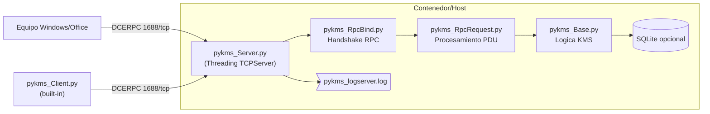

> **Aviso legal**: Este proyecto se distribuye con fines educativos y de investigacion. Emular servicios KMS de Microsoft fuera de los terminos de licencia aplicables puede infringir acuerdos comerciales y legislacion local. Usalo unicamente en laboratorios controlados y bajo tu responsabilidad.

## Introduccion

El proyecto **KMS-Emu** es un fork de [py-kms](https://github.com/SystemRage/py-kms) que moderniza el soporte para versiones recientes de Windows y Office, simplifica el despliegue mediante Docker y anade utilidades extra como una base de datos SQLite opcional y un cliente de prueba integrado. En esta entrada repasamos la arquitectura, el flujo de activacion y las piezas clave que permiten emular un servidor Key Management Service completamente funcional desde Python.

## Arquitectura general

En esencia, el emulador expone el puerto TCP `1688`, acepta sesiones RPC/DCERPC, procesa las solicitudes de activacion y devuelve respuestas validas con los `ePID`, contadores y tiempos que esperan los clientes KMS oficiales.



### Componentes principales

- **Servidor TCP multihilo** (`pykms_Server.py`): usa `socketserver.ThreadingMixIn` para aceptar multiples conexiones y soporta escucha dual IPv4/IPv6. Implementa un bucle personalizado (`pykms_serve`) que convive con la GUI opcional del proyecto original.
- **Canal RPC/DCERPC** (`pykms_RpcBind.py`, `pykms_RpcRequest.py`): gestiona el bind inicial, verifica los contextos de sintaxis y enruta los PDUs de activacion hacia la logica de negocio.
- **Motor KMS** (`pykms_Base.py` y `pykms_RequestV4/V5/V6.py`): deserializa la solicitud, consulta la base de datos XML (`KmsDataBase.xml`) para identificar productos, genera un `ePID` valido y arma la respuesta cifrada (incluyendo el HMAC y los salts propios del protocolo v6).
- **Persistencia opcional** (`pykms_Sql.py`): registra transacciones unicas (CMID, SKU, estado de licencia) en SQLite y expone la base via `sqlite_web` cuando la variable `SQLITE=true`.
- **Cliente de pruebas** (`pykms_Client.py`): simula distintos productos Microsoft, realiza el handshake RPC, permite forzar CMID/nombres y soporta descubrimiento DNS `_vlmcs._tcp`.

### Desglose interior del servidor

El modulo `pykms_Server.py` arranca un hilo dedicado (`server_thread`) que encapsula una instancia de `KeyServer`. Este objeto:

- Crea pares de sockets (`socket.socketpair`) para recibir senales de parada sin bloquear el bucle principal.
- Usa `selectors.PollSelector` (cuando esta disponible) para multiplexar sockets IPv4/IPv6 y garantizar compatibilidad con entornos que no permiten dual-stack.
- En cada conexion, delega en `kmsServerHandler`, que preserva el `srv_config` global con el contexto de la sesion y el ultimo `call_id`.

El `srv_config` se rellena mediante `server_options()` y `server_check()`. Aqui se normalizan los tipos, se validan rangos y se resuelve `RANDOM` a un HWID concreto (`uuid.uuid4().hex` truncado a 16 caracteres).

## Flujo de activacion paso a paso


### Detalles relevantes del protocolo

- El servidor soporta versiones **4, 5 y 6** del protocolo KMS; la version 6 incorpora cifrado AES CBC y un HMAC SHA-256 con derivacion propia descrita en `pykms_RequestV6`.
- El contador de clientes (minimo/maximo) se ajusta automaticamente si se fija `CLIENT_COUNT`: protege de activaciones consideradas “no genuinas”.
- El `HWID` se genera al vuelo cuando se configura como `RANDOM` (default) y se valida que cumpla los 16 digitos hexadecimales exigidos por Microsoft.
- Los registros se centralizan en un logger `logsrv` que admite niveles estandarizados y rotacion por tamano (`LOGSIZE`).

### Pila DCERPC a detalle

1. `kmsServerHandler.handle()` lee bloques de hasta 1024 bytes; el primer paquete suele ser un `bindReq`.
2. `pykms_RpcBind.handler` analiza el `MSRPCHeader`, valida la lista de contextos (`CtxItemArray`) y responde con un `bindAck`. Si el cliente solicita sintaxis de 32 bits (`uuidNDR32`) se concede (`Result=0`), mientras que otras variantes reciben codigos `Result=2` o `Result=3`.
3. Cuando llega un `request`, `pykms_RpcRequest.handler` crea un `MSRPCRequestHeader`, extrae el `pduData` y llama a `generateKmsResponseData`.
4. `generateKmsResponseData` determina la version del protocolo y reenvia a `kmsRequestV4`, `kmsRequestV5` o `kmsRequestV6`. Cada clase hereda de `kmsBase` y aporta sus particularidades criptograficas.
5. Para versiones 5 y 6, el payload se cifra con AES-CBC. En v6, `getMACKey()` deriva la clave HMAC a partir de constantes conocidas (`c1`, `c2`, `c3`) y el `requestTime`, replicando el algoritmo oficial documentado por la comunidad de reverse engineering.

### Generacion del ePID y contadores

- `kmsBase.createKmsResponse` llama a `epidGenerator`, que combina el SKU solicitado, la version del protocolo y el `LCID` para construir una cadena compatible con los formatos genuinos de Microsoft (por ejemplo `05477-00206-123-000123-03-1033-9200.0000-1102021`).
- Si el operador fija `CLIENT_COUNT`, el servidor ajusta internamente el `currentClientCount` a los limites esperados: minimos de 26 para clientes y 6 para servidores. Si el valor esta fuera de rango, se muestra un `warning` y se corrige.
- Los intervalos `activation` (por defecto 120 minutos) y `renewal` (7 dias) se devuelven literalmente al cliente, por lo que se pueden personalizar para testear escenarios de renovacion acelerada.

### Base de datos de soporte

`kmsDB2Dict` transforma `KmsDataBase.xml` en una estructura de diccionarios con metadatos de todos los SKU soportados. Esta tabla incluye:

- Identificadores de aplicacion (`ApplicationId`) para grupos como Windows o Office.
- Elementos `KmsItems` con el `DefaultKmsProtocol` (4, 5 o 6) y `NCountPolicy` que define cuantos clientes hacen falta para activar de forma valida.
- Listado de `SkuItems` con nombres descriptivos y GUIDs reales, usados para mostrar mensajes de log amigables.

## Persistencia y auditoria

Cuando `SQLITE=true`, `pykms_Sql.py` crea o abre `pykms_database.db` con un esquema sencillo:

- Tabla `RequestLog` con columnas `MachineName`, `CMID`, `SkuName`, `LicenseStatus`, `RequestTime`, `LastEPID`.
- Indices por `CMID` para evitar duplicados. Las funciones `sql_update` y `sql_update_epid` insertan la primera visita y actualizan el ePID asociado.
- `sqlite_web` se sirve por defecto en el mismo host y puerto indicado por `IP`, permitiendo navegar la base en modo solo lectura.

El logger `logsrv` soporta niveles adicionales como `MININFO`, que produce lineas compactas del tipo:

```
[2025-11-11 10:13:45] [MININFO] --- 192.168.1.33 | Windows 11 Enterprise | Grace Period
```

Este formato facilita integrar el servidor en pipelines ELK o Prometheus (via exporters personalizados).

## Despliegue y ejecucion

### Variables de entorno

El contenedor muestra claramente los parametros mas importantes en el `Dockerfile.amd64`:

- `IP` / `PORT`: interfaz y puerto de escucha.
- `LCID`: idioma para la generacion de `ePID` (1033 = en-US).
- `CLIENT_COUNT`, `ACTIVATION_INTERVAL`, `RENEWAL_INTERVAL`: emulan los valores esperados por clientes volumen.
- `SQLITE`, `LOGLEVEL`, `LOGFILE`, `LOGSIZE`: toggles operativos.

### Script de arranque

`start.sh` inspecciona las variables y compone la linea exacta para `pykms_Server.py`. Cuando `SQLITE=true`, lanza simultaneamente:

1. El servidor Python con bandera `-s` apuntando al archivo `pykms_database.db`.
2. El cliente de prueba (`pykms_Client.py -m Windows10`) para verificar una activacion de “calentamiento”.
3. `sqlite_web` en modo solo lectura para consultar el historico via navegador.

### Docker

El contenedor Alpine instala dependencias minimas (Python 3, `peewee`, `pysqlite3`, `tzlocal`, `dnspython`) y expone el puerto configurado. Con la imagen publicada (`ghcr.io/4h1g4l0w4/kms-emu:v1`) basta:

```bash
sudo docker run -d --name kms-emu \
  -p 1688:1688 \
  -e IP=0.0.0.0 \
  -e PORT=1688 \
  -e SQLITE=true \
  --restart unless-stopped ghcr.io/4h1g4l0w4/kms-emu:v1
```

Para laboratorios sin Docker, los scripts `build-py3-kms.sh` y `run-py3-kms.sh` reproducen el entorno en una virtualenv local.

### Secuencia de inicio interna

1. `start.sh` exporta las variables y decide si usa `sqlite_web`.
2. El servidor Python arranca en segundo plano cuando se necesita la base de datos; se duerme 5 segundos para asegurar que el socket `1688` esta listo.
3. Se lanza `pykms_Client.py` para autocurva de clientes: al ejecutar una activacion automatica se inicializa la base y se comprueba el pipeline criptografico.
4. Finalmente, `sqlite_web.py` expone la UI para auditar los registros acumulados.

## Observabilidad y almacenamiento

- **Logs**: se generan en `pykms_logserver.log` (y STDOUT segun configuracion). La salida “MININFO” resume maquina/estado/producto por solicitud.
- **SQLite**: almacena solo el ultimo estado por CMID y actualiza el `ePID` cuando se devuelve la respuesta, util para auditoria.
- **Grafismos**: la carpeta `graphics/` contiene GIFs heredados de la GUI original; en esta version CLI no se utilizan pero se conservan.

### Integracion con clientes reales

Para validar la emulacion frente a sistemas Windows u Office:

1. Configura el servidor KMS en el cliente con `slmgr /skms <ip-servidor>:1688`.
2. Establece la clave KMS apropiada (`slmgr /ipk <KMS-client-setup-key>`).
3. Lanza `slmgr /ato` y revisa `pykms_logserver.log` para confirmar el handshake y verificar el SKU detectado.
4. En Office, usa `cscript ospp.vbs /sethst:<ip-servidor>` seguido de `cscript ospp.vbs /act`.

Si deseas emular escenarios de fallo (por ejemplo contadores insuficientes), fija `CLIENT_COUNT` a valores menores de 25 y observa como el servidor responde con advertencias y, potencialmente, como el cliente marca la activacion como no genuina tras la siguiente comprobacion.

## Recomendaciones practicas

1. **Aislamiento**: ejecuta el contenedor en redes internas y bloquea el puerto 1688 desde Internet.
2. **Sincronizacion horaria**: clientes KMS son sensibles a desfases >4h; usa `TZ` y `ntpd` en el host.
3. **Persistencia cifrada**: si habilitas SQLite, monta un volumen dedicado (`-v /ruta/db:/home/py-kms`) y protejelo con ACLs.
4. **Pruebas**: valida el flujo con `pykms_Client.py` y observa los contadores antes de conectar endpoints reales.

## Conclusiones

KMS-Emu aporta una plataforma ligera para estudiar el protocolo de activacion volumetrica de Microsoft. Su modularidad permite inspeccionar cada capa (socket, RPC, cifrado, almacenamiento), replicar escenarios en contenedores y entender el ciclo completo sin dependencias binarios cerrados. Ideal para laboratorios de reverse engineering, cursos de redes seguras o pruebas de automatizacion orientadas a licenciamiento.

