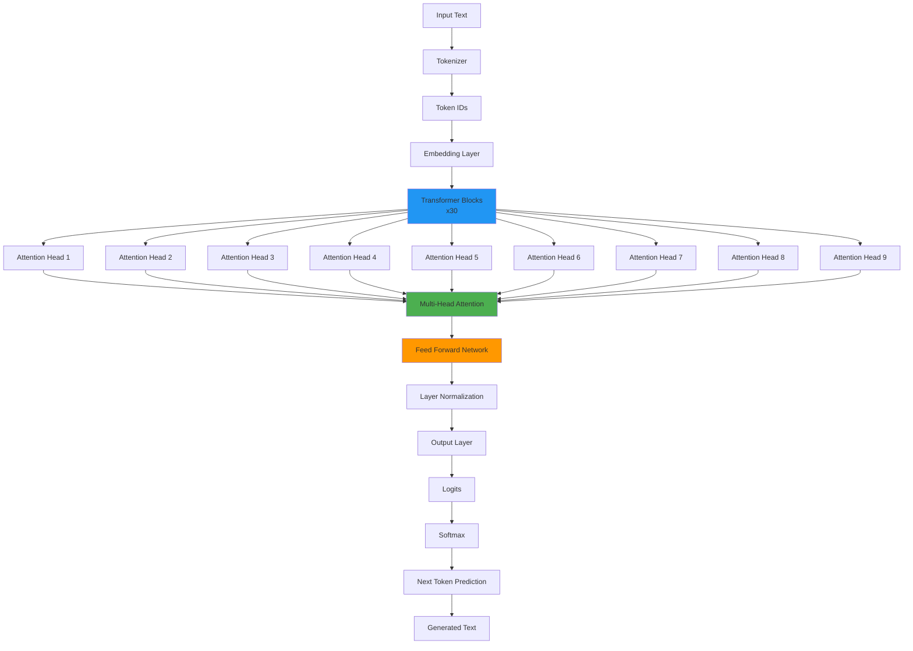

## Introducción

En los últimos años, hemos visto un crecimiento exponencial en el tamaño y la complejidad de los modelos de lenguaje (LLMs). Tradicionalmente, estos modelos requieren servidores potentes con GPUs dedicadas para ejecutarse. Sin embargo, con los avances en cuantización de modelos y las nuevas APIs web como WebGPU y WebAssembly, ahora es posible ejecutar modelos de lenguaje directamente en el navegador del usuario.

En este artículo, exploraremos cómo construir una aplicación web que ejecuta el modelo **SmolLM2-135M-Instruct** completamente en el cliente, sin necesidad de un backend. Utilizaremos **Transformers.js**, **ONNX Runtime Web**, y aprovecharemos **WebGPU** cuando esté disponible, con un fallback automático a **WebAssembly**.

## Arquitectura de la Solución


## Tecnologías Utilizadas

### 1. Transformers.js

**Transformers.js** es una biblioteca JavaScript que permite ejecutar modelos de Hugging Face directamente en el navegador. Está construida sobre **ONNX Runtime Web** y proporciona una API de alto nivel similar a la biblioteca Python `transformers`.

**Características principales:**
- Ejecución 100% en el cliente (sin servidor)
- Soporte para múltiples tareas: text-generation, text-classification, question-answering, etc.
- Optimización automática para WebGPU y WebAssembly
- Caché inteligente de modelos en el navegador

### 2. ONNX Runtime Web

**ONNX Runtime Web** es la versión web de ONNX Runtime, un motor de inferencia de alto rendimiento para modelos de machine learning. Soporta múltiples backends:


**Ventajas de ONNX:**
- Formato estándar para modelos de ML
- Optimizaciones específicas del navegador
- Soporte para cuantización (INT8, INT4, etc.)
- Interoperabilidad entre frameworks

### 3. WebGPU vs WebAssembly

#### WebGPU
- **Ventajas:**
  - Aceleración por GPU (10-100x más rápido que CPU)
  - Paralelización masiva
  - Acceso directo a recursos de GPU
  
- **Limitaciones:**
  - Requiere navegadores modernos (Chrome 113+, Edge 113+)
  - Necesita drivers de GPU actualizados
  - No disponible en todos los dispositivos

#### WebAssembly (WASM)
- **Ventajas:**
  - Compatibilidad universal
  - Rendimiento predecible
  - No requiere GPU
  
- **Limitaciones:**
  - Más lento que WebGPU (pero más rápido que JavaScript puro)
  - Limitado por el rendimiento de CPU

### 4. Cuantización de Modelos

La cuantización reduce la precisión de los pesos del modelo para disminuir el tamaño y aumentar la velocidad de inferencia:


En nuestro proyecto, utilizamos **BNB4** (BitsAndBytes 4-bit), que ofrece un excelente equilibrio entre tamaño, velocidad y calidad.

## Estructura del Proyecto

```
LLM-on-browser/
├── index.html                    # Interfaz de usuario
├── main.js                       # Lógica principal
├── style.css                     # Estilos
├── Dockerfile                    # Configuración Docker
├── docker-compose.yml            # Orquestación Docker
├── .dockerignore                 # Exclusiones Docker
└── SmolLM2-135M-Instruct/        # Modelo local
    ├── config.json               # Configuración del modelo
    ├── generation_config.json    # Configuración de generación
    ├── tokenizer.json            # Tokenizador
    ├── tokenizer_config.json     # Config del tokenizador
    └── onnx/
        └── model_bnb4.onnx       # Modelo ONNX cuantizado (175MB)
```

## Flujo de Ejecución


## Implementación Detallada

### 1. Configuración del Entorno

```javascript
import { pipeline, env } from 'https://cdn.jsdelivr.net/npm/@huggingface/transformers@3.0.0';

// Configurar para usar solo modelos locales
env.allowLocalModels = true;
env.allowRemoteModels = false;
env.localURL = '';
```

**Explicación:**
- `allowLocalModels = true`: Permite cargar modelos desde el sistema de archivos local
- `allowRemoteModels = false`: Desactiva la descarga desde Hugging Face Hub
- `localURL = ''`: Configura la ruta base para modelos locales

### 2. Detección de Dispositivo

```javascript
async function detectDevice() {
    let device = 'wasm';
    let deviceName = 'WebAssembly';
    
    // Verificar si WebGPU está disponible
    if ('gpu' in navigator) {
        try {
            const adapter = await navigator.gpu.requestAdapter();
            if (adapter) {
                device = 'webgpu';
                deviceName = 'WebGPU';
            }
        } catch (error) {
            console.warn('WebGPU no disponible:', error);
        }
    }
    
    return device;
}
```

**Flujo de detección:**


### 3. Inicialización del Modelo

```javascript
async function initializeModel() {
    try {
        const device = await detectDevice();
        
        generator = await pipeline(
            'text-generation',
            'SmolLM2-135M-Instruct',
            {
                dtype: 'bnb4',
                device: device,
            }
        );
        
        updateStatus('Modelo cargado correctamente ✓', 'success');
    } catch (error) {
        // Manejo de errores con fallback
    }
}
```

**Proceso de carga del modelo:**


### 4. Generación de Texto

```javascript
async function generateResponse() {
    const prompt = promptInput.value.trim();
    
    const result = await generator(prompt, {
        max_new_tokens: 100,
        temperature: 0.7,
        top_p: 0.9,
        do_sample: true,
    });
    
    // Procesar y mostrar resultado
}
```

**Parámetros de generación:**
- `max_new_tokens`: Número máximo de tokens a generar
- `temperature`: Controla la aleatoriedad (0.0 = determinista, 1.0+ = creativo)
- `top_p`: Nucleus sampling - considera solo los tokens con probabilidad acumulada
- `do_sample`: Habilita muestreo probabilístico vs. greedy decoding

## Arquitectura del Modelo SmolLM2



**Especificaciones del modelo:**
- **Arquitectura**: LlamaForCausalLM
- **Parámetros**: 135M
- **Capas**: 30
- **Heads de atención**: 9
- **Hidden size**: 576
- **Vocabulario**: ~32,000 tokens
- **Contexto máximo**: 8,192 tokens

## Optimizaciones y Mejoras

### 1. Caché de Modelos

Los modelos se almacenan en el caché del navegador usando IndexedDB, permitiendo cargas más rápidas en visitas posteriores.

### 2. Streaming de Respuestas

Aunque no implementado en esta versión, Transformers.js soporta streaming de tokens, permitiendo mostrar resultados mientras se generan.

### 3. Batching

Para múltiples solicitudes, se puede implementar batching para mejorar el throughput.

## Despliegue con Docker

### Dockerfile

```dockerfile
FROM nginx:alpine

# Copiar archivos de la aplicación
COPY index.html /usr/share/nginx/html/
COPY main.js /usr/share/nginx/html/
COPY style.css /usr/share/nginx/html/

# Copiar el modelo al directorio esperado por Transformers.js
COPY SmolLM2-135M-Instruct/ /usr/share/nginx/html/models/SmolLM2-135M-Instruct/

EXPOSE 80
CMD ["nginx", "-g", "daemon off;"]
```

**Estructura en el contenedor:**


### Docker Compose

```yaml
services:
  web:
    build: .
    ports:
      - "8080:80"
    container_name: smollm2-browser
    restart: unless-stopped
```

## Consideraciones de Rendimiento

### Tiempos de Carga


### Velocidad de Inferencia

- **WebGPU**: ~20-50 tokens/segundo
- **WebAssembly**: ~5-15 tokens/segundo
- **JavaScript puro**: ~1-3 tokens/segundo

## Limitaciones y Desafíos

### 1. Tamaño del Modelo

Aunque 175MB es relativamente pequeño, aún puede ser un desafío para:
- Conexiones lentas
- Dispositivos con almacenamiento limitado
- Navegadores con caché restringido

### 2. Rendimiento en Dispositivos Móviles

Los dispositivos móviles tienen limitaciones:
- Menor potencia de GPU
- Menos memoria RAM
- Batería limitada

### 3. Compatibilidad del Navegador


## Casos de Uso

1. **Aplicaciones Offline**: Funcionamiento sin conexión a internet
2. **Privacidad**: Datos nunca salen del dispositivo del usuario
3. **Reducción de Costos**: No requiere servidores de inferencia
4. **Baja Latencia**: Sin comunicación de red
5. **Demostraciones**: Prototipos rápidos sin infraestructura

## Conclusiones

Ejecutar modelos de lenguaje en el navegador es ahora una realidad gracias a:

- **Cuantización avanzada** que reduce el tamaño de los modelos
- **WebGPU** que proporciona aceleración por GPU
- **WebAssembly** que ofrece compatibilidad universal
- **Transformers.js** que simplifica la integración

Aunque hay limitaciones, esta tecnología abre nuevas posibilidades para aplicaciones web que requieren inteligencia artificial sin depender de servidores externos.

## Recursos Adicionales

- [Transformers.js Documentation](https://huggingface.co/docs/transformers.js)
- [ONNX Runtime Web](https://onnxruntime.ai/docs/tutorials/web/)
- [WebGPU Specification](https://www.w3.org/TR/webgpu/)
- [SmolLM2 Model Card](https://huggingface.co/HuggingFaceTB/SmolLM2-135M-Instruct)

## Código Fuente

El código completo está disponible en el repositorio del proyecto. Para ejecutarlo:

```bash
# Con Docker
docker compose up --build

# O con servidor HTTP local
python -m http.server 8000
```

Luego abre `http://localhost:8080` (o `http://localhost:8000`) en tu navegador.

---

*Este artículo fue escrito como parte de una exploración de las capacidades de machine learning en el navegador. Las tecnologías web continúan evolucionando, y esperamos ver modelos más grandes y eficientes ejecutándose completamente en el cliente en el futuro cercano.*

